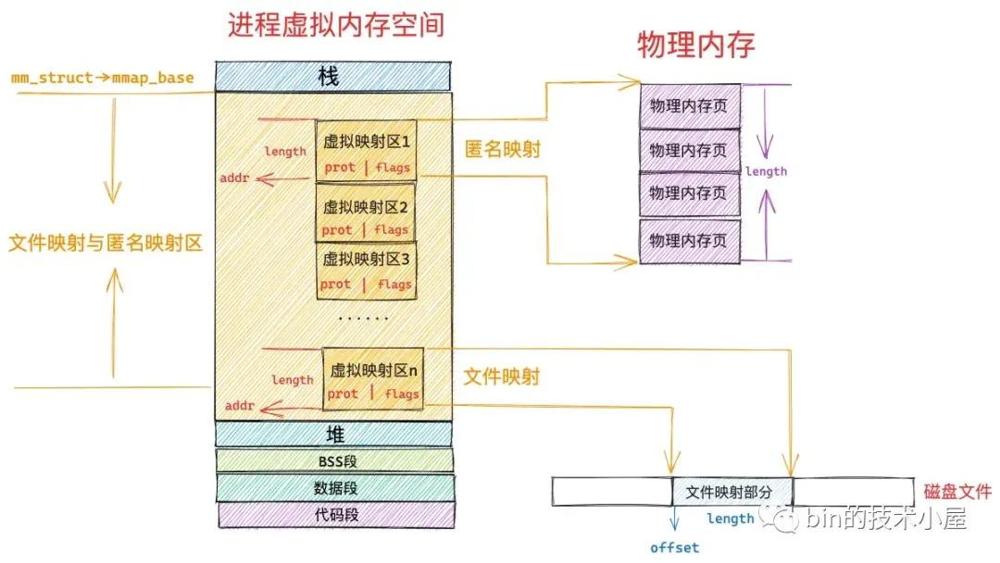
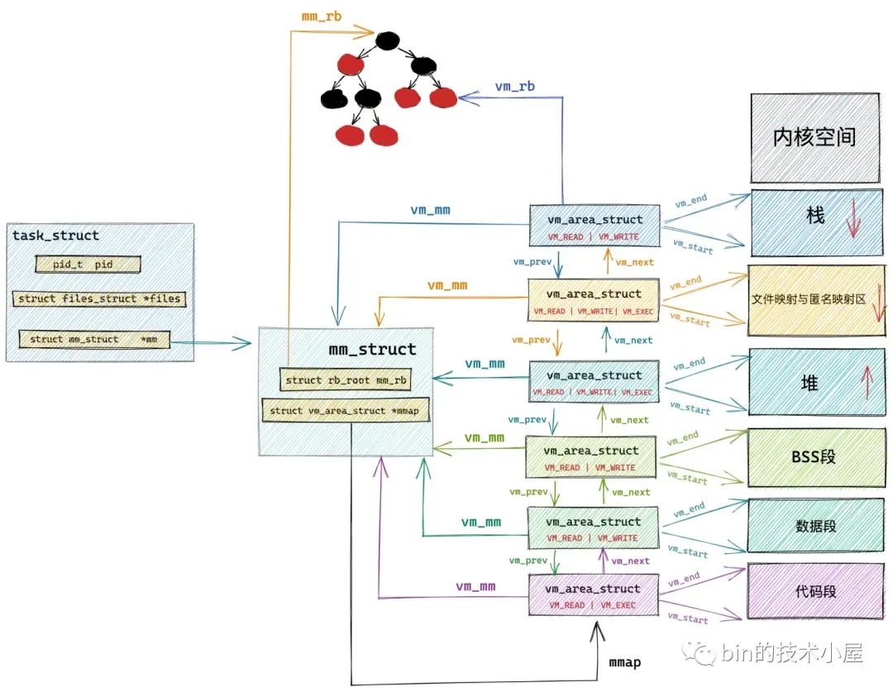

```table-of-contents
```

# 介绍

mmap函数是一种**内存映射文件**的方法，它可以**将一个文件或设备映射到进程的地址空间中，使得进程可以像访问内存一样访问文件或设备**。
mmap可以分为：**文件映射和匿名映射**。

# mmap 函数
```c
#include <sys/mman.h>  
void* mmap(void* addr, size_t length, int prot, int flags, int fd, off_t offset);  
  
// 内核文件：/arch/x86/kernel/sys_x86_64.c  
SYSCALL_DEFINE6(mmap, unsigned long, addr, unsigned long, len,  
  unsigned long, prot, unsigned long, flags,  
  unsigned long, fd, unsigned long, off)
```



## 参数
### addr 和 length


- addr ： 表示我们要映射的这段虚拟内存区域在进程虚拟内存空间中的起始地址（虚拟内存地址），但是这个参数只是给内核的一个暗示，内核并非一定得从我们指定的 addr 虚拟内存地址上划分虚拟内存区域，内核只不过在划分虚拟内存区域的时候会优先考虑我们指定的 addr，如果这个虚拟地址已经被使用或者是一个无效的地址，那么内核则会自动选取一个合适的地址来划分虚拟内存区域。我们一般会将 addr 设置为 NULL，意思就是完全交由内核来帮我们决定虚拟映射区的起始地址。

- length ：从进程虚拟内存空间中的什么位置开始划分虚拟内存区域的问题解决了，那么我们要申请的这段虚拟内存有多大呢 ？ 这个就是 length 参数的作用了，如果是匿名映射，length 参数决定了我们要映射的匿名物理内存有多大，如果是文件映射，length 参数决定了我们要映射的文件区域有多大。

>注： ==addr，length 必须要按照 PAGE_SIZE（4K） 对齐==。

### prot(protection)
指定映射区域的保护方式。可以是以下几种值的组合：  
```c
#define PROT_READ 0x1  /* page can be read */  
#define PROT_WRITE 0x2  /* page can be written */  
#define PROT_EXEC 0x4  /* page can be executed */  
#define PROT_NONE 0x0  /* page can not be accessed */


The prot argument describes the desired memory protection of the mapping (and must not conflict with the open mode of the file).  It is either PROT_NONE or the bitwise OR of one or  more  of  the
following flags:
   PROT_EXEC  : Pages may be executed.
   PROT_READ  : Pages may be read.
   PROT_WRITE : Pages may be written.
   PROT_NONE  : Pages may not be accessed.
```
**PROT_READ** 表示该虚拟内存区域背后映射的物理内存是可读的。
    
**PROT_WRITE** 表示该虚拟内存区域背后映射的物理内存是可写的。
    
**PROT_EXEC** 表示该虚拟内存区域背后映射的物理内存所存储的内容是可以被执行的，该内存区域内往往存储的是执行程序的机器码，比如进程虚拟内存空间中的代码段，以及动态链接库通过文件映射的方式加载进文件映射与匿名映射区里的代码段，这些 VMA 的权限就是 PROT_EXEC 。
    
**PROT_NONE** 表示这段虚拟内存区域是不能被访问的，既不可读写，也不可执行。用于实现防范攻击的 guard page。如果攻击者访问了某个 guard page，就会触发 SIGSEV 段错误。除此之外，指定 PROT_NONE 还可以为进程预先保留这部分虚拟内存区域，虽然不能被访问，但是当后面进程需要的时候，可以通过 mprotect 系统调用修改这部分虚拟内存区域的权限。

### flags
指定映射区域的标志。可以是以下几种值的组合：  
```c
#define MAP_FIXED   0x10        /* Interpret addr exactly */  
#define MAP_ANONYMOUS   0x20        /* don't use a file */  
  
#define MAP_SHARED  0x01        /* Share changes */  
#define MAP_PRIVATE 0x02        /* Changes are private */

#define MAP_LOCKED 0x2000  /* pages are locked */  
#define MAP_POPULATE  0x008000 /* populate (prefault) pagetables */  
#define MAP_HUGETLB  0x040000 /* create a huge page mapping */
```
**MAP_SHARED**：与其他进程共享映射区域。  
**MAP_PRIVATE**：不与其他进程共享映射区域。  
**MAP_FIXED**：指定映射区域的起始地址。如果指定了这个标志，则 addr 参数必须为非 NULL。  
**MAP_ANONYMOUS**：不映射任何文件，而是映射一段匿名的内存区域。

#### MAP_POPULATE

##### 背景
`mmap()` 默认只是建立了**虚拟地址空间的映射关系**，但并不马上分配物理页；直到下次真正访问地址空间时发现数据不存在于物理内存空间时，触发 `Page Fault` 即缺页中断，由内核分配物理页并建立页表映射。

这在访问大文件或大内存映射时可能导致：
- 首次访问延迟高（大量 page fault）；访问时的抖动（延迟分布不均）；
- 内存分配的时候，系统的内存已经比较乱了，不知道系统会从那个numa节点去分配，而且极端的时候，发生内存短缺，会换出内存页面，这个时间非常不可控。内存的分配也无法准确的指定。

**思路**：
如果我们能够在系统内存还比较干净的时候，比如刚开机或者刚做完`vm.drop_caches=3`的时候，去把我们需要的内存或者数据预先按照我们设想的方式来准备，虽然这个集中化的动作会化很长的时间，但是换来的是后续的可控性。

##### 作用
```bash
MAP_POPULATE (since Linux 2.5.46)
        Populate (prefault) page tables for a mapping.  For a file
        mapping, this causes read-ahead on the file.  This will
        help to reduce blocking on page faults later.
        MAP_POPULATE is supported for private mappings only since
        Linux 2.6.23.
```
**populate page table**，提前分配并映射物理页，减少后续访问的缺页中断。


### offset 和 fd
当我们将 mmap 系统调用参数 flags 指定为 `MAP_ANONYMOUS` 时，表示我们需要进行匿名映射，既然是匿名映射，fd 和 offset 这两个参数也就没有了意义，fd 参数需要被设置为 -1 。

当我们进行文件映射的时候，只需要指定 fd 和 offset 参数就可以了。

如果我们通过 mmap 映射的是磁盘上的一个文件，那么就需要通过参数 fd 来指定要映射文件的描述符（file descriptor），通过参数 offset 来指定文件映射区域在文件中偏移。


### 注意
在内存管理系统中，物理内存是按照内存页为单位组织的；在文件系统中，磁盘中的文件是按照磁盘块为单位组织的，内存页和磁盘块大小一般情况下都是 4K 大小，所以这里的 offset 也必须是按照 4K 对齐的。

# 内核中实现
## VMA



# mmap映射分类
## 匿名映射和文件映射
操作系统对于物理内存的管理是按照内存页为单位进行的，而内存页的类型有两种：一种是匿名页，另一种是文件页。

根据内存页类型的不同，内存映射也自然分为两种：一种是虚拟内存对匿名物理内存页的映射，另一种是虚拟内存对文件页的也映射，也就是我们常提到的匿名映射和文件映射。

## 共享映射和私有映射
根据 mmap 创建出的这片虚拟内存区域背后所映射的**物理内存**能否在多进程之间共享，又分为了两种内存映射方式：

- `MAP_SHARED` 表示共享映射，通过 mmap 映射出的这片内存区域在多进程之间是共享的，一个进程修改了共享映射的内存区域，其他进程是可以看到的，用于多进程之间的通信。
    
- `MAP_PRIVATE` 表示私有映射，通过 mmap 映射出的这片内存区域是进程私有的，其他进程是看不到的。如果是私有文件映射，那么多进程针对同一映射文件的修改将不会回写到磁盘文件上

## 四种组合


### 私有匿名映射
`MAP_PRIVATE | MAP_ANONYMOUS` 表示私有匿名映射，

#### 使用场景
##### 为进程申请虚拟内存
我们常常利用这种映射方式来申请虚拟内存，比如，我们使用 glibc 库里封装的 malloc 函数进行虚拟内存申请时，当申请的内存大于 128K 的时候，malloc 就会调用 mmap 采用私有匿名映射的方式来申请堆内存。因为它是私有的，所以申请到的内存是进程独占的，多进程之间不能共享。

##### 用在 execve 系统调用中
私有匿名映射还会应用在 execve 系统调用中，execve 用于在当前进程中加载并执行一个新的二进制执行文件：
```c
#include <unistd.h>  
  
int execve(const char* filename, const char* argv[], const char* envp[])
```


# mmap的使用场景
`mmap`是 Linux系统的一种内存映射机制，允许**将文件或设备直接映射到进程的虚拟地址空间**。进程通过操作内存指针即可读写文件，无需调用 `read`/`write` 等系统调用。mmap内存映射在Linux系统中广泛被使用，如：内存分配、零拷贝网络传输、进程间通信、大文件处理等。

## 内存分配
## 进程间通信
## 大文件处理


# mmap和大页内存
## 大页内存申请
```c
unsigned flag = (21UL<< MAP_HUGE_SHIFT) | MAP_PRIVATE | MAP_ANONYMOUS | MAP_HUGETLB | MAP_POPULATE;
if (!(size % (1*1024*1024*1024))) {
    // try 1G page
    flag = (30UL<< MAP_HUGE_SHIFT) | MAP_PRIVATE | MAP_ANONYMOUS | MAP_HUGETLB | MAP_POPULATE;
    addr = mmap(NULL, size, PROT_READ | PROT_WRITE, flag, -1, 0);
    if (addr == MAP_FAILED) {
        // try 2M page
        flag = (21UL<< MAP_HUGE_SHIFT) | MAP_PRIVATE | MAP_ANONYMOUS | MAP_HUGETLB | MAP_POPULATE;
        addr = mmap(NULL, size, PROT_READ | PROT_WRITE, flag, -1, 0);
    }
} else {
    addr = mmap(NULL, size, PROT_READ | PROT_WRITE, flag, -1, 0);
}
```
## 设备DMA map
参考：[# DPDK内存管理 —— DMA MAP](https://zhuanlan.zhihu.com/p/585094736)
参考：[libtpa中的tpa_heap.c文件中关于dma map的使用]()
```c
rte_dev_dma_map
```


# 进程之间通过mmap共享内存
## 通过 `mmap` 将同一个文件或共享内存区域映射到多个进程的地址空间中
这种方式创建的共享内存具有以下特点：
- 各进程看到的是**同一段物理内存**：两个进程共享同一个文件映射的内存
- **内存改动可见于其他进程**
- 需要一定的同步机制（如加锁）来避免数据竞争

## 2个进程通过mmap共享，不加锁，可不可以？
如果为了高性能，2个进程通过mmap共享，不加锁，可不可以？比如其中一个进程作为只是作为统计进程，读取统计信息；另外一个进程是主体进程。

**可以，但要小心使用**。如果设计得当，**两个进程通过 `mmap` 共享内存而不加锁是可行的**，特别是当：
- 一个进程只读（比如统计进程）
- 一个进程只写（比如数据生产者）
- 对数据一致性的要求**不是特别严格**
- 或者你设计了**无锁通信协议**


### 合理情况下无锁 mmap 是可行的
场景如下：
> **进程 A：写入统计数据（例如计数器）**  
> **进程 B：周期性读取这些数据进行分析或打印**

你可以这么设计：
- 进程 A 定期更新结构体中的统计字段
- 进程 B 只读这些字段，不尝试修改
- 允许进程 B 读到“正在写的值”，即 **可能读取到中间状态或旧值**

#### 注意
##### 内存访问一致性问题

如果写入的值跨越多个字节（比如 `int64_t`），而 CPU 没有原子地写入它：
- 读者进程**可能看到一个被撕裂的值**（例如，低位是新值，高位是旧值）

解决方式：
- 对共享变量使用原子类型，如 GCC 的 `__atomic_store` / `__atomic_load`
- 或仅共享小于等于 `word size` 的字段（如 32 位系统中共享 `int`）

##### 编译器/CPU 重排序问题
即使你写的是：
```c
counter++;
flag = 1;
```

编译器或 CPU 可能会将其重排序为：
```c
flag = 1;
counter++;
```

导致读者看到 `flag == 1`，但 `counter` 还没更新。

解决方式：
- 使用原子操作（如 `__atomic_store`、内存屏障等）来控制顺序

##### 可能读到旧值或不一致值
对于统计类数据（如计数器），即使读取时存在短暂不一致，也不会影响准确性太大，可以接受
```c
// 主进程周期性更新共享数据结构 stats
stats.requests += 1;
stats.errors += 1;

// 统计进程周期性读取 stats，打印日志
printf("Req: %d, Errors: %d\n", stats.requests, stats.errors);

```

只要写入频率不远高于读取频率，读取“延迟”几次更新是可以接受的。

#### 高级优化技巧
##### 加版本号 + 再读确认一致
这是经典 lock-free 技巧：
```c
struct Stats {
    uint64_t version;
    uint64_t req_count;
    uint64_t err_count;
    uint64_t version_check;
};

```

(1) 写入时顺序写入：
```bash
- `version += 1`
- 写入字段
- `version_check = version`
```

(2)  读取操作：
```c
do {
    uint64_t v1 = stats->version_check;
    req = stats->req_count;
    err = stats->err_count;
    uint64_t v2 = stats->version;
} while (v1 != v2);

```
这个模式称为 “versioned snapshot”，在共享内存读取一致状态时非常有效，无需加锁，也不会丢数据。

##### 双缓冲区（Double Buffering 的 lock-free 技巧）
注：双缓冲适合状态快照，对于累计类数据需要注意，需要读取上一个 buffer 值进行累加。

```c
struct Stats {
    int request_count;
};

struct Shared {
    struct Stats buffer[2];
    int current_index;
};


1> 写操作：
int old_index = shared->current_index;
int new_index = !old_index;

shared->buffer[new_index].request_count = shared->buffer[old_index].request_count + 1;

shared->current_index = new_index;


2> 读操作：
int idx = shared->current_index;
printf("Reader: %d\n", shared->buffer[idx].request_count);
```


##### 原子类型
使用 C11 或 GCC 提供的原子变量：
```c
#include <stdatomic.h>

typedef struct {
    atomic_int requests;
    atomic_int errors;
} Stats;


1> 写入
atomic_fetch_add(&stats->requests, 1);


2> 读取
int req = atomic_load(&stats->requests);
```
也可以用 `__atomic_store_n(&counter, value, __ATOMIC_RELEASE);` 等

# mmap 与 set_mempolicy / mbind  / mlock 的结合
## set_mempolicy：影响后续分配的 NUMA 策略
## mbind：为已有地址设置 NUMA 策略
```c
#include <numaif.h>

int mbind(void *addr, unsigned long len, int mode,
		 unsigned long *nodemask, unsigned long maxnode,
		 unsigned flags);
```
## mlock/mlockall：锁页，禁止换出

## 小结

|接口|作用|影响阶段|典型组合|
|---|---|---|---|
|`MAP_POPULATE`|提前分配页，预防 page fault|映射时|`mmap + MAP_POPULATE`|
|`set_mempolicy()`|影响后续分配的 NUMA 策略|调用后新分配|`set_mempolicy + mmap`|
|`mbind()`|为已有地址设置 NUMA 策略|运行中|`mmap + mbind`|
|`mlock()`|锁页，禁止换出|运行时|`mmap + MAP_POPULATE + mlock`|

# 进程的maps文件和smaps
## `/proc/pid/maps`文件

## `/proc/pid/smaps`文件

## `/proc/pid/map_files`目录


# 其他
## malloc 底层是匿名私有mmap

在 Linux 中，`malloc` 是 C 库（glibc）提供的函数，它并不是一个系统调用。它底层通过 `sbrk` 或 `mmap` 向内核申请内存：
- **对于小额申请**（默认 < 128 KB）：使用 `sbrk` 扩展堆（Heap）。
- **对于大额申请**（默认 > 128 KB）：使用 `mmap` 创建一个独立的映射区域。

无论哪种方式，最终在内核视角下，它们都属于 **Anonymous Private Mapping**。

|**特性**|**是否 Anonymous (匿名)**|**是否 Private (私有)**|**解释**|
|---|---|---|---|
|**malloc 内存**|**是**|**是**|它不关联磁盘文件（匿名），且每个进程拥有独立副本，不与其他进程共享（私有）。|


### 为什么是 Anonymous (匿名)？

`malloc` 申请的内存不需要从磁盘文件加载内容，也不需要将修改写回文件。它的后端存储（Backing Store）是系统物理内存，或者在物理内存不足时，存储在 **Swap（交换分区）** 中。

### 为什么是 Private (私有)？

`malloc` 分配的内存是进程独占的。

- 如果进程调用 `fork()`，根据 COW (写时复制) 机制，子进程会看到父进程内存的一个镜像。
- 但一旦子进程尝试修改这块内存，内核就会为子进程复制一个物理页。
- 如果它是 Shared（共享）的，子进程的修改会直接改变父进程的数据，这显然不符合 `malloc` 的常识。

### 如何在系统中观察到它？
你可以写一个简单的 `malloc` 程序，然后查看 `/proc/self/maps`：

```bash
# 假设 0x12345000 是 malloc 返回地址所在的段
7f88a4000000-7f88a4021000 rw-p 00000000 00:00 0

- `rw-p`：其中的 `p` 就代表 Private。
- `00:00 0`：设备号和 Inode 均为 0，代表没有关联文件，即 Anonymous。
```


## 程序的全局变量和mmap

在 Linux C 编译和运行模型中，全局变量（存放在 `.data` 和 `.bss` 段）在进程启动时由操作系统加载。
从 `mmap` 的映射类型来看，它们属于 **File-backed Private Mapping（文件支持的私有映射）**。

### 为什么是 File-backed（文件支持）

全局变量存在于你的**可执行二进制文件**（ELF 文件）中：

- **`.data` 段**：存放已经初始化的全局/静态变量（如 `int g_val = 100;`）。这些初始值直接存储在磁盘上的 ELF 文件里。
- **`.bss` 段**：存放未初始化或初始化为 0 的全局/静态变量（如 `int g_zero;`）。虽然它在磁盘上不占空间，但它属于 ELF 文件的元数据描述。

当程序启动时，内核的加载器（Loader）会调用 `mmap`，将 ELF 文件中的这些段映射到内存中。

### 为什么是 Private（私有）

**逻辑**：虽然映射源是同一个磁盘文件，但内核必须保证一个进程修改全局变量时，不会把修改写回磁盘上的 ELF 文件（否则下次运行程序初值就变了），也不会影响其他正在运行该程序的进程。
    
**机制**：内核使用 `MAP_PRIVATE` 标志。这触发了 **COW（写时复制）** 机制。一旦进程尝试修改全局变量，内核会拷贝该物理页，让进程在副本上修改。

### 在 `/proc/pid/maps` 中的表现

如果你观察一个运行中的进程，你会看到类似这样的条目：
```bash
cat /proc/xxx/maps 

00400000-006ec000 r-xp 00000000 08:03 7605056                            /home/relay/xxx/kperf
006ed000-006f3000 r-xp 002ec000 08:03 7605056                            /home/relay/xxx/kperf
006f3000-00770000 rwxp 002f2000 08:03 7605056                            /home/relay/xxx/kperf
00770000-030cd000 rwxp 00000000 00:00 0
036b5000-036d6000 rwxp 00000000 00:00 0                                  [heap]
036d6000-0380c000 rwxp 00000000 00:00 0                                  [heap]
100000000-10002f000 rwxp 00000000 00:00 0
140000000-940000000 ---p 00000000 00:00 0
940000000-940001000 rwxp 00000000 00:00 0
980000000-1180000000 ---p 00000000 00:00 0
1180000000-1180001000 rwxp 00000000 00:00 0
11c0000000-19c0000000 ---p 00000000 00:00 0
19c0000000-19c0001000 rwxp 00000000 00:00 0
1a00000000-2200000000 ---p 00000000 00:00 0
2200000000-2200061000 rwxp 00000000 00:00 0
2200200000-2200400000 rwxp 00000000 00:10 14970354                       /anon_hugepage (deleted)
2200400000-2200600000 rwxp 00000000 00:10 14970355                       /anon_hugepage (deleted)
```


```bash
- `r-xp`：`p` 代表 Private。
- 路径：显示了 ELF 文件的路径，证明它是 File-backed。
- 偏移量：非零值代表这块内存对应文件中的某个位置（即 `.data` 或 `.bss` 段所在的位置）。
```


### `coredump_filter`为`0x33`，为什么可以看到初始化的全局变量的内容
初始化的全局变量，存放在`.data` 段，加载`.data` 段不是 `file-backed、MAP_PRIVATE` 吗？  为什么 `coredump_filter`为`0x33`产生的`coredump`，还可以看到全局变量的值呢？

#### 程序刚启动时(加载时)

`.data` 段：
```bash
mmap(file=a.out,
     MAP_PRIVATE,
     PROT_READ | PROT_WRITE)

```

此时：VMA 是 `file-backed private`；页内容来自 ELF 文件；
因此，对于已初始化的变量，它们最初是“私有文件映射”（Private file-backed mapping）。

#### 程序运行时（写了全局变量）

一旦程序对这些变量进行了`写操作`, 根据“写时复制”（Copy-on-Write, COW）机制，这些页面就会变成该进程私有的，性质上类似于 `Anonymous private memory`。

#### 单个进程也存在COW吗？
在教科书里，COW 通常和 `fork()` 挂钩。但实际上，COW 是 Linux 内存管理的一种通用优化手段，即使在单进程中，它也无处不在。
比如：对于全局变量（`.data` 段），即便你从未手动 `fork`，它依然涉及 COW 机制。

当你运行一个程序时，内核会将可执行文件（ELF）中的 `.data` 段（已初始化的全局变量）映射到内存中。

比如：对于全局变量（`.data` 段），即便你从未手动 `fork`，它依然涉及 COW 机制。

```c
int g = 1;   // 初始化的全局变量存储在 .data

加载时：
	mmap(a.out, MAP_PRIVATE, PROT_READ|PROT_WRITE)


关键点：
- a.out： 说明是文件映射
- MAP_PRIVATE: 说明是私有的，不允许回写到文件，也就是最开始页是只读物理页
- PROT_READ|PROT_WRITE： 说明mmap返回的vma是可读可写的；
```

更改全局变量时：一旦你的代码修改了全局变量，CPU 会发现你试图写入一个标记为“只读”的页面，从而触发一个**缺页异常（Page Fault）**。
- 内核介入，发现这是一个 `MAP_PRIVATE` 映射。
- 内核在 RAM 中找一个干净的空闲页，把原数据拷贝过去。
- 这个新拷贝的页面现在变成了**匿名页面（Anonymous Page）**，它不再属于原来的文件。然后拷贝原内容；

```bash
发生了什么？

1. page fault（写一个不可写页）
2. 内核分配匿名页
3. 拷贝原内容
4. 建立新的 PTE（可写）
```

==因此，一个进程也可以出现COW==；

这也是为什么，`coredump_filter` 默认为`0x33`, 出现了`coredump`时，依然可以打印初始化的全局变量的值。
==因为程序刚启动：初始化的全局变量是“文件后台页面”（File-backed private page）。
程序运行并修改变量：该页面通过 COW 变成了“私有匿名页面” (Private Anonymous Memory)==。


### 程序中的变量类型与 mmap 类型的对比表

|**变量类型**|**存储段**|**映射类型**|**备注**|
|---|---|---|---|
|**已初始化全局/静态**|`.data`|**File-backed Private**|初始值从 ELF 文件读取|
|**未初始化全局/静态**|`.bss`|**Anonymous Private** (注1)|实际上内核为了优化，会将 BSS 映射为全零的匿名页|
|**局部变量**|`Stack`|**Anonymous Private**|栈内存，无对应文件|
|**malloc 内存**|`Heap`|**Anonymous Private**|堆内存，无对应文件|


**注1**：虽然 `.bss` 段在概念上属于 ELF 的一部分，但由于它全是 0，内核通常直接将其映射到特殊的“零页”（Zero Page）上，这在行为上更接近 **Anonymous Private**。


## mmap和 Direct IO对比

内存映射和 Direct IO 都是用来提高文件读写性能的技术，但它们之间有一些不同。

首先，内存映射是将文件映射到进程的地址空间中，而 Direct IO 是直接使用文件描述符进行读写操作。因此，内存映射可以充分利用虚拟内存系统的优势，而 Direct IO 则可以避免缓存的影响。

其次，内存映射可以实现文件的共享访问，而 Direct IO 则不行。这是因为 Direct IO 会绕过文件系统缓存，而文件系统缓存是用来实现文件共享访问的。

最后在内存映射中，修改过的数据会被缓存在内存中，并不会立即写回到磁盘中。如果需要将数据写回到磁盘中，可以使用 msync() 函数或者 munmap() 函数来实现。而 Direct IO 是可以直接将数据写入磁盘的。

# 参考
```bash
# 3 万字 + 40 张图 ｜ 拆解 mmap 内存映射的本质！
https://mp.weixin.qq.com/s/sLoiOevTxIonrgLa7yWJkw

# 万字图文拆解零拷贝：从DMA到mmap，彻底搞懂高性能IO
https://mp.weixin.qq.com/s/IHwuaiggixTzpataKMLl1g

# 同样是mmap崩溃，为什么有时是SIGSEGV，有时是SIGBUS？99%的开发者都分不清
https://mp.weixin.qq.com/s/fUO4hu1QrSbCVwYCfmGnLQ

# mmap图解
https://mp.weixin.qq.com/s/W7dcBy3IuMwKFjMScOVWgg
https://mp.weixin.qq.com/s/ZSaZggYjYHYtVTof0Dmz4A

# Linux Mmap映射：优化文件访问和共享内存
https://zhuanlan.zhihu.com/p/685848279

# 大疆二面追问：如何通过内存映射提高文件读写性能？
https://mp.weixin.qq.com/s/tzRcbH1fWta4hSkUqoWCEQ


# mmap的使用
https://mp.weixin.qq.com/s/hmazpJTjd6TxZaV1KvoXkA
```