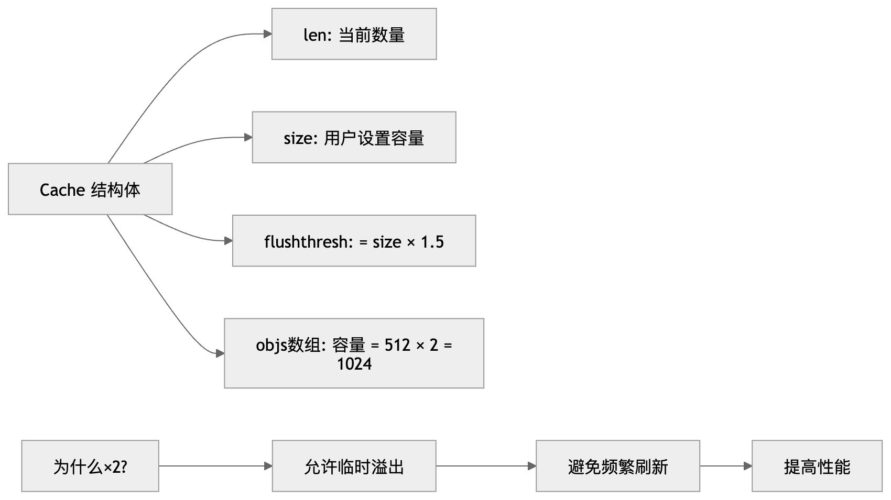
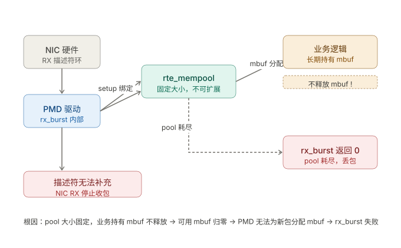

```table-of-contents
```

# mempool的per-core的缓存cache
## 背景
在多核系统中，如果多个核心频繁访问同一个内存池的“空闲对象环形队列（ring）”，**每次访问都需要执行原子操作（比如 CAS）**，这会带来很高的 CPU 开销。

## 思路
如何优化？
为了避免这种频繁的共享访问，**DPDK 为每个核心维护了一个本地缓存（per-core cache）**：
- 内存池分配器不再每次都从全局 ring 获取对象
- 而是先从当前核心自己的 cache 中取/还对象
- 只有当本地 cache **空了或满了**，才进行一次批量交互（bulk get/put）
比如：创建mempool的时候，起始本地cache是空的，在rte_mempool_get发现本地cache是空的，才会从公共的ring池子中申请，填充本地cache；

### 总结
==带`cache`的`mempool` = 独立资源池+公共资源池==：**独立资源池为了高性能，公共资源池为了容量扩展**。

每个线程(每个线程绑定到不同的core上)都有自己的独立资源池(即：cache)，这样性能很高。
当某个线程的自身的独立资源池（cache）的资源不足时，还有一个公共资源池。

### 拓展
**问题**
由于`mempool`的`cache`，设置的是每个`core`最大是`512`，不能更大了，然后某个`core`的`cache`不足之后，就需要从`mempool`的公共资源池中申请，对于多生产者多消费者而言，公共资源池中的元素通过`rte_ring`来管理，那么就存在`CAS`加锁的问题。

**思路**
依照：带`cache`的`mempool` = 独立资源池+公共资源池的思路。
可以每个线程再单独创建一个不带`cache`的单生产者、单消费者的`mempool`「前提： 元素的生产、释放都只能在一个线程中」。
独占的`mempool`的资源不足时，还有一个共享的带有`cache`的`mempool`。

## 缓存结构
本地缓存结构：

- 是一个**小型数组**，保存对象指针（用于后续复用）
- 用一个栈结构（top 指针）维护
- 每个核心独占，不共享
- 在创建内存池时可以选择**启用或禁用**

```c
struct rte_mempool_cache {
    uint32_t size;          // 缓存容量
    uint32_t flushthresh;   // 刷新阈值 = size * 1.5
    uint32_t len;           // 当前缓存数量
    void *objs[RTE_MEMPOOL_CACHE_MAX_SIZE * 2] __rte_cache_aligned;
};
```



**设计原因**：

1. **内存效率**：每个 lcore 都有独立的 cache，如果 cache 太大，会浪费内存
2. **Cache Line 对齐**：objs 数组按 cache line 对齐，512 个指针 ≈ 8 个 cache line (64字节/line)
3. **预分配溢出空间**：objs 数组容量是 CACHE_MAX_SIZE × 2 = 1024，允许 cache 临时超过 flushthresh

## cache获取以及释放策略
### 获取策略
DPDK 的 cache 获取策略是"批量"操作。当 cache 不够时，会一次性从 backend ring 获取 cache_size + n 个对象：

```c
// lib/mempool/rte_mempool.h (第1531-1532行)
ret = rte_mempool_ops_dequeue_bulk(mp, cache->objs,
        cache->size + remaining);  // 批量获取 cache_size + 需要的数量
```

### 释放策略

```c
if (cache->len + n <= cache->flushthresh) {
    // 情况1: 不超阈值，直接加入 cache
    cache_objs = &cache->objs[cache->len];
    cache->len += n;
} else {
    // 情况2: 超阈值，先刷新整个 cache 到 backend
    cache_objs = &cache->objs[0];
    rte_mempool_ops_enqueue_bulk(mp, cache_objs, cache->len);
    cache->len = n;  // 只保留新放入的 n 个
}
```

## 自定义外部缓存（External Cache）

除了默认的 per-lcore 缓存外，你也可以==使用 **用户自定义的外部缓存**，这个对于没有lcore-id的外部线程是有用的==。通过以下 API 实现：
```c
rte_mempool_cache_create() 
rte_mempool_cache_free() 
rte_mempool_cache_flush()


/**
 * Create a user-owned mempool cache.
 *
 * This can be used by unregistered non-EAL threads to enable caching when they
 * interact with a mempool.
 *
 * @param size
 *   The size of the mempool cache. See rte_mempool_create()'s cache_size
 *   parameter description for more information. The same limits and
 *   considerations apply here too.
 * @param socket_id
 *   The socket identifier in the case of NUMA. The value can be
 *   SOCKET_ID_ANY if there is no NUMA constraint for the reserved zone.
 */
struct rte_mempool_cache *
rte_mempool_cache_create(uint32_t size, int socket_id);
```

# mempool的debug
## 调试模式中的“Cookie”（Cookies）
当开启 **调试模式（debug mode）** 时，DPDK 会在每个分配的对象前后加上一些特殊字段，称为 **cookie**。
这些字段的作用是：**用来检测内存越界或覆盖错误**（例如缓冲区溢出、未对齐访问）。

## 内存池统计（Stats）
如果启用了 **统计模式（stats mode）**，DPDK 会记录关于从内存池获取/归还对象的统计数据。
这些统计信息保存在 `mempool` 结构体中：
- 例如：每次 `rte_mempool_get()` 和 `rte_mempool_put()` 的次数；
- **每个 lcore 单独维护统计数据**，避免多核并发更新同一个计数器时出现锁竞争；

# mempool的ops（Mempool Handler）
在 `DPDK` 中，每个内存池通过一个名字进行标识，并通过一种称为 **mempool handler** 的机制来管理空闲对象。

## 默认的ops
`rte_mempool_ring`
默认的 handler 是基于 **环形队列（ring-based）** 的实现。参考：`drivers/mempool/ring/rte_mempool_ring.c` 文件。


## 自定义的ops
添加自定义 `ops/handler` 的代码（实现 `mempool` 操作集）；这就相当于**注册一个新的内存池类型**，告诉 `DPDK` 如何分配/释放对象。

你需要：
- 实现自己的 **mempool ops 操作结构体**（比如实现 `.alloc`, `.put`, `.get` 等函数）
- 用宏注册它：`RTE_MEMPOOL_REGISTER_OPS(my_mempool_ops);`

### dpdk应用中实现自定义的ops

可以在应用程序中实现并注册，无需修改 DPDK 源码；
DPDK 的 mempool ops 机制支持**运行时注册**，不强制要求编译进 DPDK 源码。


## 使用新的 ops 创建内存池
使用新的 `ops` 创建内存池，你需要使用如下 API：
```c
rte_mempool_create_empty(const char *name, unsigned n, unsigned elt_size,
	unsigned cache_size, unsigned private_data_size,
	int socket_id, unsigned flags);

int rte_mempool_set_ops_byname(struct rte_mempool *mp, const char *name, void *pool_config);
```
调用顺序是：

4. 使用 `rte_mempool_create_empty()` 创建一个空内存池
5. 使用 `rte_mempool_set_ops_byname()` 指定你要使用的 `handler`（通过名字）

这样这个内存池就会使用你实现的 `ops` 回调逻辑。

### ops结构定义
```c
// lib/mempool/rte_mempool.h
struct rte_mempool_ops {
    char name[RTE_MEMPOOL_OPS_NAMESIZE]; // ops 名称（最大 32 字符）

    // 必须实现的回调
    rte_mempool_alloc_t   alloc;       // 初始化 pool_data（如创建 ring）
    rte_mempool_free_t    free;        // 释放 pool_data
    rte_mempool_enqueue_t enqueue;     // 将 n 个对象放入 pool
    rte_mempool_dequeue_t dequeue;     // 从 pool 取出 n 个对象
    rte_mempool_get_count get_count;   // 返回 pool 中可用对象数

    // 可选回调（NULL 则使用默认实现）
    rte_mempool_calc_mem_size_t calc_mem_size; // 计算所需内存大小
    rte_mempool_populate_t      populate;       // 填充对象到 pool
    rte_mempool_get_info_t      get_info;       // 获取额外信息
    rte_mempool_dequeue_contig_blocks_t dequeue_contig_blocks; // 连续块出队
} __rte_cache_aligned;


// alloc：在 pool 首次 populate 时调用，用于初始化 pool_data
typedef int (*rte_mempool_alloc_t)(struct rte_mempool *mp);

// free：销毁 pool 时调用，释放 pool_data
typedef void (*rte_mempool_free_t)(struct rte_mempool *mp);

// enqueue：将 n 个对象指针放回 pool（归还对象）
// 成功返回 0，失败返回负数
typedef int (*rte_mempool_enqueue_t)(struct rte_mempool *mp,
        void * const *obj_table, unsigned int n);

// dequeue：从 pool 取出 n 个对象（分配对象）
// 成功返回 0，失败返回 -ENOBUFS
typedef int (*rte_mempool_dequeue_t)(struct rte_mempool *mp,
        void **obj_table, unsigned int n);

// get_count：返回 pool 中当前可用对象数
typedef unsigned (*rte_mempool_get_count)(const struct rte_mempool *mp);

```
### 全局ops
```c
// lib/mempool/rte_mempool.h
#define RTE_MEMPOOL_MAX_OPS_IDX 16  // 最多注册 16 种 ops

struct rte_mempool_ops_table {
    rte_spinlock_t sl;     // 注册时的保护锁
    uint32_t num_ops;      // 已注册数量
    struct rte_mempool_ops ops[RTE_MEMPOOL_MAX_OPS_IDX];
} __rte_cache_aligned;
```

**重要设计**：mempool 结构中存储的是 ops_index（整数下标），而不是函数指针。这是因为在多进程（primary/secondary）场景下，各进程的共享库加载地址可能不同，函数指针无法跨进程使用，而整数下标是进程无关的。

### 多个 ops 同时用
你可以在同一个程序中使用多个不同的 `ops`，比如：

- 一个`mempool` 使用默认 `ring` 实现
- 另一个 `mempool` 使用你自定义的 `NUMA-aware` 实现


只要分别设置 `ops` 就可以：
```c
rte_mempool_set_ops_byname(pool1, "ring_mp_mc"); 
rte_mempool_set_ops_byname(pool2, "my_custom_ops");
```

老版本程序一般调用的是：

```c
rte_mempool_create()
```

这个会默认使用 `ring-based handler`。

如果你想切换到新的 `ops`，你需要修改老程序，改用：

```c
rte_mempool_create_empty() + set_ops_byname()
```


### 默认ops和自定义ops
#### 旧接口 `rte_mempool_create()` 的特点
##### 优点
- 简洁，一行搞定：pool创建 + 绑定 handler（ops） + 初始化 + 填充
- 默认使用 **ring-based handler**（适用于大多数通用场景）
- 对于多数 mbuf 使用者足够方便

##### 缺点

|局限点|说明|
|---|---|
|handler 写死|默认使用 ring_mp_mc，不支持自由选择|
|不支持外部内存|比如不能直接用 hugepage file、DMA 区、设备共享内存等|
|扩展性差|不能参与高级定制（NUMA-aware 分配、自定义缓存结构、共享跨设备 buffer 等）|
|某些 flags 不好设置|比如想禁用缓存、启用自定义对齐、物理地址映射控制等受限|

#### 新接口（组合式 API）
##### 使用流程

```c
struct rte_mempool *mp = rte_mempool_create_empty("my_pool", ...);
rte_mempool_set_ops_byname(mp, "ring_mp_mc");     // 可选任何 handler
rte_mempool_populate_default(mp);                // 填充内存
```

##### 新接口的优势

|优势点|描述|
|---|---|
|**高度灵活**|handler 不写死，你可以随时切换，比如使用 DPDK 自带的 `stack`, `bucket`, 或你自定义的|
|**支持外部内存（external memory）**|适配 zero-copy、DMA 显存、设备共享内存等场景|
|**更适合高级应用**|比如网络设备的 buffer 共享、zero-copy、多 NUMA 节点、PMD 驱动协同管理内存等|
|**分步控制，利于调试与扩展**|每一步可插入调试信息、限制策略，构建更复杂的 mempool 创建逻辑|
|**更好支持 testing 和插件机制**|可以动态加载 handler `.so` 文件，插件式扩展内存管理|


##### 适用场景
在哪些情况下使用新接口有 **“显著性能收益”**？

|场景类型|是否建议用新接口|提升点|
|---|---|---|
|NUMA 优化|强烈推荐|降低远程访问开销|
|外部内存 / DMA 显存|必须|Zero-copy、设备共享|
|启动优化|可选|批量填充更快|
|多 PMD 共享 mempool|推荐|内存节省、性能更稳定|
|软件测试、模拟|推荐|更轻更快更可控|
|简单 mbuf 分配|可继续用老接口|无需切换|

#### 新老接口对比
老接口：
```c
struct rte_mempool *mp = rte_mempool_create("mypool", 1024,
                   2048, 512, sizeof(struct rte_pktmbuf_pool_private),
                   NULL, NULL, NULL, NULL, SOCKET_ID_ANY, 0);
```


新接口：
```c
struct rte_mempool *mp = rte_mempool_create_empty("mypool", 1024,2048, 512, SOCKET_ID_ANY, 0);
rte_mempool_set_ops_byname(mp, "ring_mp_mc");
rte_mempool_populate_default(mp);
```

## pktmbuf的 ops 设置
如果你用的是 `rte_pktmbuf_create()`，可以通过配置宏来指定默认使用的 `mempool ops`：
```c
#define RTE_MBUF_DEFAULT_MEMPOOL_OPS "my_ops_name"
```

这样就不用每次都手动 `set ops`，配置文件统一控制即可。

## ops 动态库
如果你的程序使用了 DPDK 的 **共享库（shared libraries）**；你可以通过 EAL 参数 `-d` 指定要加载的 ops `.so` 动态库
```c
./app -d my_handler.so
```

 如果是多进程程序，所有子进程使用的 `-d` 参数 **必须顺序一致**，否则会导致 ops 注册失败或行为错乱。

## 小结
通俗总结：

|内容|说明|
|---|---|
|handler 是什么？|指定一个内存池具体怎么分配/释放的实现方式（比如 ring、stack、GPU buffer）|
|怎么用？|注册 ops 结构体 + `rte_mempool_create_empty()` + `set_ops_byname()`|
|能多个用吗？|一个程序可以同时用多个不同 handler|
|老程序能用吗？|默认用 ring handler，要改代码才能换 handler|
|动态加载注意什么？|所有进程的 `-d` 参数顺序必须一致|

# mempool的内存对齐
在 x86 架构上，根据硬件内存配置的不同，通过在对象之间添加**特定的内存填充（padding）**，可以显著提升性能。

原因是：
通常只访问数据包的**前 64 字节**（例如只看头部做决策），如果所有包的起始地址都落在同一个通道（channel），那 CPU 就只能从一个通道拉数据，造成瓶颈。而如果起始地址均匀分布在多个通道（channel）上，**多个通道（channel）可以并行工作，访问带宽显著提升**。

## 内存对齐的目标
优化的目标是：
确保每个对象的起始地址**落在不同的内存通道（channel）和 rank 上**，  
从而使所有内存通道被**均衡地使用**，避免瓶颈。特别是在执行 **L3 转发（forwarding）** 或 **流分类（flow classification）** 的时候，性能差异明显。

## 启用内存的channel对齐
如何启用通道（channel）/Rank 优化？
运行 DPDK 应用时，可以通过 **EAL 启动参数** 指定使用的 **内存通道（memory channels）和 rank 数量**。
```bash
./my_app --memory-channels=4
```

## 小结
通俗总结：

|概念|说明|
|---|---|
|内存通道（channel）|CPU 与内存之间的“高速通道”，多通道可并行传输|
|Rank|每个 DIMM 上可被单独访问的 DRAM 组，但它们共享通道|
|优化方式|给每个对象加合适的 padding，使它们分布在不同的通道/rank 上|
|目标|让 CPU 同时利用多个内存通道并行加载数据，提升吞吐|
|实用场景|包处理（L3、分类）只读前 64 字节时效果最明显|
|启用方式|使用 EAL 启动参数 `--memory-channels=N` 显式设置|


# API
## 数据结构

```c
// lib/mempool/rte_mempool.h
struct rte_mempool {
    char name[RTE_MEMPOOL_NAMESIZE];  // pool 名称
    union {
        void *pool_data;   // ops 私有数据（如指向 rte_ring 的指针）
        uint64_t pool_id;  // 硬件 pool 标识符（硬件 ops 使用）
    };
    void *pool_config;         // 传给 ops alloc 的可选配置
    const struct rte_memzone *mz; // memzone（pool 结构本身的存储位置）
    unsigned int flags;        // 标志位（SP_PUT/SC_GET 等）
    int socket_id;             // NUMA socket ID
    uint32_t size;             // pool 容量（最大元素数）
    uint32_t cache_size;       // per-lcore 缓存大小

    uint32_t elt_size;         // 每个元素的有效负载大小
    uint32_t header_size;      // 元素头部大小（含对齐填充）
    uint32_t trailer_size;     // 元素尾部大小（含 debug cookie）

    unsigned private_data_size; // mempool 私有数据区大小

    int32_t ops_index;         // ops 表中的索引（不存指针，多进程安全）

    struct rte_mempool_cache *local_cache; // per-lcore 缓存数组

    uint32_t populated_size;   // 已填充的元素数
    struct rte_mempool_objhdr_list elt_list;  // 元素链表
    uint32_t nb_mem_chunks;    // 内存块数量
    struct rte_mempool_memhdr_list mem_list;  // 内存块链表, 将多个内存块串联成链表（mem_list），一个 mempool 可由多个不连续的内存块组成。


struct rte_mempool
├── mem_list (内存块链表)
│   ├── memhdr 1 → 追踪内存块 1（虚拟/物理连续）
│   ├── memhdr 2 → 追踪内存块 2
│   └── memhdr N → 追踪内存块 N
│
└── elt_list (对象链表)
    ├── objhdr 1 → 对象 1 的元数据
    ├── objhdr 2 → 对象 2 的元数据
    └── objhdr M → 对象 M 的元数据
} __rte_cache_aligned;
```

|维度|memhdr (内存块)|objhdr (对象)|
|---|---|---|
|**层级**|**上层**：管理内存来源|**下层**：管理单个对象|
|**粒度**|粗粒度：一块内存包含多个对象|细粒度：每个对象一个|
|**用途**|内存追踪与释放|对象级别操作|
|**连续性**|块内虚拟/物理连续|对象间可能跨块|


.png)

### 元素内存布局


每个 mempool 元素在内存中的布局：
```c
+---------------------+
|  rte_mempool_objhdr | ← header（含反向指针到 mp 和 IOVA 地址）
+---------------------+   ← rte_mempool_get() 返回指针指向此处
|                     |
|   用户数据 (elt)    | ← elt_size 字节
|                     |
+---------------------+
|  rte_mempool_objtlr | ← trailer（debug 模式下含 cookie，生产模式为 0）
+---------------------+
|     padding         | ← 对齐填充（保证 cache line 对齐）
+---------------------+


struct rte_mempool_objhdr {
    STAILQ_ENTRY(rte_mempool_objhdr) next; // 链表指针
    struct rte_mempool *mp;   // 指回所属 mempool
    rte_iova_t iova;          // 物理/IO 地址（DMA 用）
    uint64_t cookie;          // debug cookie（仅 debug 模式）
};

/*
* 每个 memhdr 代表的内存块是虚拟和物理连续的
* 一个 mempool 可以由多个不连续的内存块组成（通过 mem_list 链表管理）
*/
struct rte_mempool_memhdr {
    RTE_STAILQ_ENTRY(rte_mempool_memhdr) next;  /**< Next in list. */
    struct rte_mempool *mp;      /**< The mempool owning the chunk */
    void *addr;                  // 内存块的虚拟起始地址，用于 CPU 访问
    rte_iova_t iova;             // IO 虚拟地址（物理地址映射），用于 DMA 操作
    size_t len;                  // 该内存块的总长度（字节）
    rte_mempool_memchunk_free_cb_t *free_cb;  // 自定义释放回调，支持不同内存来源（hugepage、external memory 等）
    void *opaque;                /**< Argument passed to the free callback */
};
```

## 关键API汇总
```c
// 创建和销毁
rte_mempool_create()            // 一步创建
rte_mempool_create_empty()      // 创建空 pool
rte_mempool_populate_default()  // 用 hugepage 填充
rte_mempool_populate_iova()     // 用自定义内存填充
rte_mempool_free()              // 销毁

// 对象分配/释放
rte_mempool_get(mp, &obj)       // 分配 1 个
rte_mempool_get_bulk(mp, objs, n)  // 分配 n 个（bulk）
rte_mempool_put(mp, obj)        // 释放 1 个
rte_mempool_put_bulk(mp, objs, n)  // 释放 n 个（bulk）

// 信息查询
rte_mempool_avail_count(mp)     // 当前可用数量
rte_mempool_in_use_count(mp)    // 已分配数量
rte_mempool_full(mp)            // 是否满
rte_mempool_empty(mp)           // 是否空

// ops 管理
rte_mempool_register_ops()      // 手动注册 ops
rte_mempool_set_ops_byname()    // 为 pool 设置指定 ops
RTE_MEMPOOL_REGISTER_OPS(ops)   // 静态注册宏（推荐）

// mbuf pool 专用
rte_pktmbuf_pool_create()
rte_pktmbuf_pool_create_by_ops()
rte_mbuf_set_user_mempool_ops()
rte_mbuf_best_mempool_ops()
```

## mempool创建：一步创建（rte_mempool_create）

```c
struct rte_mempool *rte_mempool_create(
    const char *name,
    unsigned n,                    // 对象总数（推荐 2^q - 1）
    unsigned elt_size,             // 每个对象大小（字节）
    unsigned cache_size,           // per-lcore 缓存大小（0 表示禁用）
    unsigned private_data_size,    // mempool 结构后的私有数据区
    rte_mempool_ctor_t *mp_init,   // mempool 初始化回调（可 NULL）
    void *mp_init_arg,
    rte_mempool_obj_cb_t *obj_init,// 每个对象初始化回调（可 NULL）
    void *obj_init_arg,
    int socket_id,                 // NUMA socket（SOCKET_ID_ANY 不限制）
    unsigned flags                 // 标志位
);
```

内部等价于：
```c
mp = rte_mempool_create_empty(...)   // 分配 mempool 结构，注册 ops
mp_init(mp, mp_init_arg)             // 调用 mempool 初始化回调
rte_mempool_populate_default(mp)     // 分配 memzone 并填充对象
rte_mempool_obj_iter(mp, obj_init, obj_init_arg)  // 初始化每个对象
```

### 存在cache时，mempool的总的元素的个数

.png)

```c
struct rte_mempool *
rte_mempool_create(const char *name, unsigned n, unsigned elt_size,
	unsigned cache_size, unsigned private_data_size,
	rte_mempool_ctor_t *mp_init, void *mp_init_arg,
	rte_mempool_obj_cb_t *obj_init, void *obj_init_arg,
	int socket_id, unsigned flags);

struct rte_mempool_cache {
	uint32_t size;	      
	/**< Size of the cache: rte_mempool_create 设置的每个lcore的cache的大小，最大值为 RTE_MEMPOOL_CACHE_MAX_SIZE */
	
	uint32_t flushthresh; /**< Threshold before we flush excess elements */
	uint32_t len;	      /**< Current cache count: 该lcore的cache中当下可用元素的个数，实际上 len 可能大于 size */
#ifdef RTE_LIBRTE_MEMPOOL_STATS
	uint32_t unused;
	/*
	 * Alternative location for the most frequently updated mempool statistics (per-lcore),
	 * providing faster update access when using a mempool cache.
	 */
	struct {
		uint64_t put_bulk;          /**< Number of puts. */
		uint64_t put_objs;          /**< Number of objects successfully put. */
		uint64_t get_success_bulk;  /**< Successful allocation number. */
		uint64_t get_success_objs;  /**< Objects successfully allocated. */
	} stats;                        /**< Statistics */
#endif
	/**
	 * Cache objects
	 *
	 * Cache is allocated to this size to allow it to overflow in certain
	 * cases to avoid needless emptying of cache.
	 */
	void *objs[RTE_MEMPOOL_CACHE_MAX_SIZE * 2] __rte_cache_aligned; /* 此中申请2倍的 RTE_MEMPOOL_CACHE_MAX_SIZE */
} __rte_cache_aligned;
```

mempool 中元素的总个数就是：n 指定的。包含了 rte_ring 的元素的个数，以及cache的个数。
rte_mempool_create 创建的时候，rte_ring 的大小就是 n，cache的当前的实际大小为0，设定的size = cache_size；
因此，==rte_mempool_create 中的 n 就是 总大小，最终可供使用的总个数==。


### obj_init：创建mempoll的同时设置每个obj对象的回调函数进行对象的初始化
```c
/**
 * An object callback function for mempool.
 *
 * Used by rte_mempool_create() and rte_mempool_obj_iter().
 */
typedef void (rte_mempool_obj_cb_t)(struct rte_mempool *mp,
        void *opaque, void *obj, unsigned obj_idx);
typedef rte_mempool_obj_cb_t rte_mempool_obj_ctor_t; /* compat */

参数：
	obj: 这个对象的地址
	obj_idx：对象的索引，比如mempool中含有n个对象+m个cache；该对象的索引。
```

#### mempool含有cache与否是否影响实体初始化时实体的idx？
应该是不影响。因为，创建mempool的时候，实际上是没有cache的。
只有进行`rte_mempool_get/put`的时候，cache中才可能会有元素。

#### 使用场景
比如：正常情况下，创建一个实体大小为`4k`，一共有N个实体的`mempool`，那么`mempool`的每个元素的大小就是`4k`。
另外，一种方法，也可以是提前通过`rte_malloc`申请`4k*N`的空间，然后`mempool`中的每个元素只是一个包含其对应实体地址的结构体，`mempool`一共有N个这样的元素。创建`mempool`的同时，通过元素初始化的回调函数`obj_init`来初始化每个元素中对应实体地址。

## mempool创建：分步创建
```c
// 步骤 1：创建空 pool（仅分配结构体，不分配对象内存）
mp = rte_mempool_create_empty(name, n, elt_size, cache_size,
                               private_data_size, socket_id, flags);

// 步骤 2（可选）：指定自定义 ops
rte_mempool_set_ops_byname(mp, "ring_mp_mc", NULL);

// 步骤 3：填充内存（可自定义内存来源）
rte_mempool_populate_default(mp);   // 使用 memzone（hugepage）
// 或
rte_mempool_populate_iova(mp, vaddr, iova, len, free_cb, opaque);  // 自定义内存
// 或
rte_mempool_populate_anon(mp);      // 匿名 mmap

// 步骤 4：初始化每个对象
rte_mempool_obj_iter(mp, my_obj_init, NULL);
```


### 内存填充机制（populate）
rte_mempool_populate_default() 流程：
```bash
6. 调用 ops->calc_mem_size() 计算所需内存大小
7. 通过 rte_memzone_reserve_aligned() 分配 hugepage 内存
8. 调用 rte_mempool_populate_iova() 或 rte_mempool_populate_virt()
   ├── 考虑页边界，确保单个对象不跨页（IOVA 连续性要求）
   ├── 为每个对象写入 rte_mempool_objhdr
   ├── 将对象加入 mp->elt_list
   └── 调用 ops->enqueue() 把对象入队到 pool_data（ring）
9. 完成后触发 RTE_MEMPOOL_EVENT_READY 回调
```


#### rte_mempool_populate_iova 和 rte_mempool_populate_virt

.png)

|维度|rte_mempool_populate_iova()|rte_mempool_populate_virt()|
|---|---|---|
|**物理连续性假设**|整块虚拟/物理连续|仅虚拟连续，物理可能分段|
|**IOVA 参数**|**必须提供**（或 RTE_BAD_IOVA）|自动查找（通过页表）|
|**页面大小参数**|不需要|**必须提供** pg_sz|
|**内部处理**|单次填充|循环查找物理连续片段|
|**性能**|快速（O(1)）|较慢（需要遍历页表）|
|**适用场景**|硬件 buffer pool、memzone|匿名映射、不确定物理布局|


##### rte_mempool_populate_iova

```c
int
rte_mempool_populate_iova(struct rte_mempool *mp, char *vaddr,
    rte_iova_t iova, size_t len, ...)
{
    // 1. 分配 memhdr 记录这块内存
    memhdr = rte_zmalloc("MEMPOOL_MEMHDR", sizeof(*memhdr), 0);
    memhdr->mp = mp;
    memhdr->addr = vaddr;
    memhdr->iova = iova;    // 直接使用传入的 IOVA
    memhdr->len = len;
    
    // 2. 对齐处理
    off = RTE_PTR_ALIGN_CEIL(vaddr, RTE_MEMPOOL_ALIGN) - vaddr;
    
    // 3. 直接调用 ops_populate 填充对象
    // 假设整块内存物理连续
    i = rte_mempool_ops_populate(mp, mp->size - mp->populated_size,
        (char *)vaddr + off,
        (iova == RTE_BAD_IOVA) ? RTE_BAD_IOVA : (iova + off),
        len - off, mempool_add_elem, NULL);
    
    // 4. 更新 NON_IO 标志（用于 DMA）
    if (!(mp->flags & RTE_MEMPOOL_F_NO_IOVA_CONTIG) && iova != RTE_BAD_IOVA)
        mp->flags &= ~RTE_MEMPOOL_F_NON_IO;
}
```

##### rte_mempool_populate_virt

```c
int
rte_mempool_populate_virt(struct rte_mempool *mp, char *addr,
    size_t len, size_t pg_sz, ...)
{
    // 如果设置了 NO_IOVA_CONTIG，直接退化到 populate_iova
    if (mp->flags & RTE_MEMPOOL_F_NO_IOVA_CONTIG)
        return rte_mempool_populate_iova(mp, addr, RTE_BAD_IOVA, len, ...);
    
    // 🔑 关键：循环查找物理连续片段
    for (off = 0; off < len && mp->populated_size < mp->size; off += phys_len) {
        
        // 查找当前偏移的 IOVA
        iova = get_iova(addr + off);
        
        // 计算最大物理连续长度
        // 从当前 offset 开始，逐页检查 IOVA 是否连续
        for (phys_len = RTE_MIN(...); 
             off + phys_len < len;
             phys_len = RTE_MIN(phys_len + pg_sz, len - off)) {
            
            iova_tmp = get_iova(addr + off + phys_len);
            
            // 如果 IOVA 不连续，停止扩展
            if (iova_tmp == RTE_BAD_IOVA || iova_tmp != iova + phys_len)
                break;
        }
        
        // 对每个物理连续片段，调用 populate_iova
        ret = rte_mempool_populate_iova(mp, addr + off, iova, phys_len, ...);
    }
}

```


基于虚拟地址得到iova地址：
```c
static rte_iova_t
get_iova(void *addr)
{
    struct rte_memseg *ms;
    
    // 优先从注册的memseg内存查找
    ms = rte_mem_virt2memseg(addr, NULL);
    if (ms == NULL || ms->iova == RTE_BAD_IOVA)
        return rte_mem_virt2iova(addr);  // 回退到物理地址
    return ms->iova + RTE_PTR_DIFF(addr, ms->addr); // addr的虚拟地址 - memseg的虚拟地址 得到偏移量 + memseg的物理地址；
}


phys_addr_t
rte_mem_virt2phy(const void *virtaddr)
{
    int fd, retval;
    uint64_t page, physaddr;
    unsigned long virt_pfn;
    int page_size;
    off_t offset;

    if (phys_addrs_available == 0)
        return RTE_BAD_IOVA;

    /* standard page size */
    page_size = getpagesize();

    fd = open("/proc/self/pagemap", O_RDONLY);
    if (fd < 0) {
        RTE_LOG(INFO, EAL, "%s(): cannot open /proc/self/pagemap: %s\n",
            __func__, strerror(errno));
        return RTE_BAD_IOVA;
    }

    virt_pfn = (unsigned long)virtaddr / page_size;
    offset = sizeof(uint64_t) * virt_pfn;
    if (lseek(fd, offset, SEEK_SET) == (off_t) -1) {
        RTE_LOG(INFO, EAL, "%s(): seek error in /proc/self/pagemap: %s\n",
                __func__, strerror(errno));
        close(fd);
        return RTE_BAD_IOVA;
    }

    retval = read(fd, &page, PFN_MASK_SIZE);
    close(fd);
    if (retval < 0) {
        RTE_LOG(INFO, EAL, "%s(): cannot read /proc/self/pagemap: %s\n",
                __func__, strerror(errno));
        return RTE_BAD_IOVA;
    } else if (retval != PFN_MASK_SIZE) {
        RTE_LOG(INFO, EAL, "%s(): read %d bytes from /proc/self/pagemap "
                "but expected %d:\n",
                __func__, retval, PFN_MASK_SIZE);
        return RTE_BAD_IOVA;
    }

    /*
     * the pfn (page frame number) are bits 0-54 (see
     * pagemap.txt in linux Documentation)
     */
    if ((page & 0x7fffffffffffffULL) == 0)
        return RTE_BAD_IOVA;

    physaddr = ((page & 0x7fffffffffffffULL) * page_size)
        + ((unsigned long)virtaddr % page_size);

    return physaddr;
}

rte_iova_t
rte_mem_virt2iova(const void *virtaddr)
{
    if (rte_eal_iova_mode() == RTE_IOVA_VA)
        return (uintptr_t)virtaddr;
    return rte_mem_virt2phy(virtaddr);
}
```


##### 选择


|场景|推荐方法|IOVA 参数|注意事项|
|---|---|---|---|
|**rx_queue mbufpool（硬件 DMA）**|populate_default（自动）或实现 ops 时用 populate_helper|必须提供有效 IOVA|检查硬件对齐要求|
|**纯软件 mempool**|populate_default 或 populate_iova(..., RTE_BAD_IOVA, ...)|RTE_BAD_IOVA|设置 NO_IOVA_CONTIG 标志|
|**外部内存（DMA）**|populate_virt + 提供 pg_sz|自动查找|确保内存已注册到 DPDK|
|**已知物理地址的外部内存**|populate_iova|直接传入 IOVA|确保物理连续|
|**匿名映射内存**|populate_virt|自动查找|提供正确的页面大小|

**核心原则**：

1. **硬件需要 DMA → 必须提供有效 IOVA**
2. **纯软件使用 → 可以用 RTE_BAD_IOVA 节省开销**
3. **不确定物理布局 → 用 populate_virt 自动查找**
4. **明确知道物理连续 → 用 populate_iova 更高效**


（1）自定义 ops 用于 rx_queue mbufpool
```c
my_mempool_populate(struct rte_mempool *mp, unsigned int max_objs,
                   void *vaddr, rte_iova_t iova, size_t len,
                   rte_mempool_populate_obj_cb_t *obj_cb, void *obj_cb_arg)
{
    // 1. 检查 IOVA 有效性（硬件 DMA 需要）
    if (iova == RTE_BAD_IOVA) {
        MY_MEMPOOL_ERR("Hardware requires valid IOVA for DMA\n");
        return -EINVAL;
    }
    
    // 2. 检查对齐（如果硬件需要）
    if (need_special_alignment) {
        return rte_mempool_op_populate_helper(mp,
            RTE_MEMPOOL_POPULATE_F_ALIGN_OBJ,
            max_objs, vaddr, iova, len,
            obj_cb, obj_cb_arg);
    }
    
    // 3. 默认情况
    return rte_mempool_op_populate_helper(mp, 0,
        max_objs, vaddr, iova, len,
        obj_cb, obj_cb_arg);
}

static const struct rte_mempool_ops my_mempool_ops = {
    .name = "my_mempool",
    .alloc = my_mempool_alloc,
    .free = my_mempool_free,
    .enqueue = my_mempool_enqueue,
    .dequeue = my_mempool_dequeue,
    .get_count = my_mempool_get_count,
    .populate = my_mempool_populate,  // ✅ 注册 populate 回调
};
```

(2) 普通软件的mempool（非mbufpool）
```c
// 应用代码：创建纯软件 mempool

struct rte_mempool *mp;

// 方案 A：使用 default populate（推荐）
mp = rte_mempool_create_empty("my_pool", 1024, 256, 0, 0, 
                               SOCKET_ID_ANY, 0);
rte_mempool_set_ops_byname(mp, "ring_mp_mc", NULL);
rte_mempool_populate_default(mp);  // 自动处理


// 方案 B：使用外部内存
void *ext_mem = mmap(NULL, mem_size, PROT_READ | PROT_WRITE,
                     MAP_PRIVATE | MAP_ANONYMOUS, -1, 0);
mp = rte_mempool_create_empty("my_pool", 1024, 256, 0, 0, 
                               SOCKET_ID_ANY, 
                               RTE_MEMPOOL_F_NO_IOVA_CONTIG);  // 不需要 DMA
rte_mempool_set_ops_byname(mp, "ring_mp_mc", NULL);

// 使用 populate_virt + pg_sz
rte_mempool_populate_virt(mp, ext_mem, mem_size, 
                          hugepage_size,  // 或系统页面大小
                          my_free_cb, NULL);
```

## rte_mempool_get

```bash
rte_mempool_get(mp, &obj)
  → rte_mempool_get_bulk(mp, &obj, 1)
    → rte_mempool_generic_get(mp, &obj, 1, cache)
      → rte_mempool_do_generic_get(mp, &obj, 1, cache)

rte_mempool_do_generic_get 内部逻辑：
  1. 若 cache != NULL：
     a. 从 cache->objs[--cache->len] 取出对象（LIFO 顺序，利用热缓存）
     b. 若 cache 为空：从 backend 批量填充 cache（fetch cache->size + remaining 个）
  2. 若 cache == NULL 或批量填充失败：
     直接调用 rte_mempool_ops_dequeue_bulk(mp, obj_table, n)
       → ops->dequeue(mp, obj_table, n)
         → rte_ring_mc_dequeue_bulk(pool_data, ...)  （ring ops）
```

rte_mempool_get：默认先从cache中取，如果cache中够，直接返回；如果cache中不够时候，剩余的部分从公共池子rte_ring中取，并且取的时候，会多取cache_size个，相当于顺便将当前core的cache也给填充满。


## rte_mempool_put

```bash
rte_mempool_put(mp, obj)
  → rte_mempool_put_bulk(mp, &obj, 1)
    → rte_mempool_generic_put(mp, &obj, 1, cache)
      → rte_mempool_do_generic_put(mp, &obj, 1, cache)

rte_mempool_do_generic_put 内部逻辑：
  1. 若 cache != NULL：
     a. 若 cache->len + n <= cache->flushthresh：
        直接加入缓存（cache->objs[cache->len++] = obj）
     b. 若即将溢出 flushthresh：
        先把整个缓存 flush 到 backend，再把新对象加入空缓存
  2. 若 cache == NULL 或 n > flushthresh：
     直接调用 rte_mempool_ops_enqueue_bulk(mp, obj_table, n)
       → ops->enqueue(mp, obj_table, n)
         → rte_ring_mp_enqueue_bulk(pool_data, ...)  （ring ops）
```

rte_mempool_put：


## rte_mempool_avail_count 和  rte_mempool_ops_get_count

DPDK 的 `rte_mempool` 是一个通用的内存对象池抽象层，其底层可以用不同的“实现”（ops）：
默认是 `ring`（基于 `rte_ring`）也可能是 `stack`、`dpaa2`、`mlx5`、`octeontx` 等 driver 特定实现
```bash
         ┌────────────────────────────┐
         │ rte_mempool                │   ← 通用接口层
         │  ├── objcnt (统计字段)     │
         │  ├── ops (指向实现函数集) │
         │  └── mem_list, cache 等    │
         └────────────┬──────────────┘
                      │
                      ▼
           ┌────────────────────────┐
           │ rte_mempool_ops_xxx    │   ← 实现层（ring/stack/driver等）
           │  ├── enqueue/dequeue   │
           │  ├── get_count         │ ← 关键：rte_mempool_ops_get_count 调这个
           │  └── ...
           └────────────────────────┘

```

（1）`rte_mempool_ops_get_count(const struct rte_mempool *mp)` 调用 `mempool` 底层实现（ops）的 `get_count()` 函数，返回**底层数据结构中可用的对象数量**。例如： 对于 `ring` 模式，就是 ring 中元素的个数（`rte_ring_count()`）；

（2）`rte_mempool_avail_count()` = 底层池（公共池）中剩余对象 + 每个线程/核 cache 中未用对象。因此，它给出的数量是**从全局视角**的、**逻辑上可用**的对象总数。
即：`avail_count` ≈ `ops_get_count` + “所有 core cache 中的可用对象”。


|函数名|层级|是否包含 per-lcore cache|返回含义|常用场景|
|---|---|---|---|---|
|`rte_mempool_avail_count(mp)`|通用层|✅ 包含|整个 mempool 当前“可用对象”的逻辑总数|用户层查看 pool 剩余容量|
|`rte_mempool_ops_get_count(mp)`|实现层|❌ 不包含|底层 ops 实现中剩余的对象数（不含 cache）|调试或实现自定义 ops|


```c
/* Return the number of entries in the mempool */
unsigned int rte_mempool_avail_count(const struct rte_mempool *mp)
{
  unsigned count;
  unsigned lcore_id;

  count = rte_mempool_ops_get_count(mp);

  if (mp->cache_size == 0)
    return count;

  for (lcore_id = 0; lcore_id < RTE_MAX_LCORE; lcore_id++)
    count += mp->local_cache[lcore_id].len;

  /*
   * due to race condition (access to len is not locked), the
   * total can be greater than size... so fix the result
   */
  if (count > mp->size)
    return mp->size;
  return count;
}


/* return the number of entries allocated from the mempool */
unsigned int
rte_mempool_in_use_count(const struct rte_mempool *mp)
{
  return mp->size - rte_mempool_avail_count(mp);
}


/**
 * Test if the mempool is full.
 *
 * When cache is enabled, this function has to browse the length of all
 * lcores, so it should not be used in a data path, but only for debug
 * purposes. User-owned mempool caches are not accounted for.
 *
 * @param mp
 *   A pointer to the mempool structure.
 * @return
 *   - 1: The mempool is full.
 *   - 0: The mempool is not full.
 */
static inline int
rte_mempool_full(const struct rte_mempool *mp)
{
  return rte_mempool_avail_count(mp) == mp->size;
}

/**
 * Test if the mempool is empty.
 *
 * When cache is enabled, this function has to browse the length of all
 * lcores, so it should not be used in a data path, but only for debug
 * purposes. User-owned mempool caches are not accounted for.
 *
 * @param mp
 *   A pointer to the mempool structure.
 * @return
 *   - 1: The mempool is empty.
 *   - 0: The mempool is not empty.
 */
static inline int
rte_mempool_empty(const struct rte_mempool *mp)
{
  return rte_mempool_avail_count(mp) == 0;
}

```

# mempool的多进程安全机制

DPDK 支持 primary/secondary 进程共享 mempool：
（1） mempool 结构存储在 memzone：通过 rte_memzone_reserve() 分配，secondary 进程启动时自动 mmap 同一物理内存；
（2）ops_index 而非函数指针：ops_index 是整数，各进程共享相同含义；函数指针因地址空间不同无法共享；
（3）ops 在 secondary 进程中重新注册：通过 RTE_INIT 构造函数，secondary 进程加载同一共享库时会重新填充 rte_mempool_ops_table，ops_index 保持一致；
（4）ring 也存储在 memzone：rte_ring_create() 使用 memzone 分配，primary/secondary 均可访问；


# QA
## 一个core中进行`rte_mempool_get`，另外一个core进行`rte_mempool_put`是否有问题？
### 背景
比如：在一个线程中通过 `rte_mempool_get` 获取到元素，然后将元素通过 `rte_ring` 传递到另外一个线程中，然后进行释放。

如果使用了cache，是否存在问题。
如果不使用cache，是否存在问题。

### 分析
**（1）整体来说，是没有问题的**：

因为：释放的时候，是将元素释放到当前线程所在的`core`的`cache`数组中，而不是基于元素原本所在的`cache`。
而 当前线程所在的`core`的`cache`数组只有当前线程才会操作，其他的线程根本不会操作，因此没有问题。

**（2）额外的影响**：
由于在一个线程中申请，在其他的线程中释放，那么申请的线程的`cache`会很快用完，那么就需要从公共资源池中申请，如果是多消费者，那么可能涉及到`cas`来操作`rte_ring`。

## mempool可以动态进行resize扩缩容吗？
在 DPDK 的标准实现中，`rte_mempool` 的大小在创建后是不支持动态 Resize（扩容或缩容）的。
一旦你调用 `rte_mempool_create` 成功申请了内存，该池包含的对象数量（`element count`）就固定了。

### 如果内存不够用了，有哪些替代方案？

虽然不能直接 `resize`，但你可以通过以下几种工程手段实现类似的效果：

#### A. 创建多个 Mempool

这是最常见的做法。如果发现当前的池子（Pool A）快满了，你可以动态创建一个新的池子（Pool B）。

**逻辑：** 应用程序维护一个 Mempool 列表。
**注意：** 这种方式增加了管理的复杂性，因为你需要决定从哪个池子里申请内存。

#### B. 使用 `rte_mempool_populate` 分步填充

虽然池子的最大容量在创建时固定，但你可以使用 `rte_mempool_create_empty` 先创建一个“空壳”，然后根据需要多次调用 `rte_mempool_populate_*` 来逐步添加内存块。
**局限：** 这依然无法突破最初设定的 `n`（对象总数）上限。

# mbufpool和mempool
mbufpool是mempool的特例，mempool中的每个元素是mbuf。

## rte_mbuf 结构
```c
// lib/mbuf/rte_mbuf_core.h
struct rte_mbuf {
    // cacheline0（前 64 字节，接收路径热字段）
    void *buf_addr;            // 数据缓冲区虚拟地址
    union { rte_iova_t buf_iova; rte_iova_t buf_physaddr; };
    uint16_t data_off;         // 数据起始偏移（含 headroom）
    uint16_t refcnt;           // 引用计数（原子操作）
    uint16_t nb_segs;          // 分段数量
    uint16_t port;             // 接收端口号
    uint64_t ol_flags;         // offload 标志（RX/TX checksum 等）
    uint32_t packet_type;      // 包类型（L2/L3/L4 协议类型）
    uint32_t pkt_len;          // 总包长（所有分段）
    uint16_t data_len;         // 当前分段数据长度
    uint16_t vlan_tci;         // VLAN TCI
    // ... hash/RSS 信息
    struct rte_mempool *pool;  // 指回所属 mempool

    // cacheline1（后 64 字节，发送路径热字段）
    struct rte_mbuf *next;     // 下一个分段（链式多段包）
    uint64_t tx_offload;       // TX offload（l2/l3/l4 len 等）
    uint16_t priv_size;        // mbuf 私有数据大小
    uint16_t timesync;
    uint32_t seqn;
    // ... 动态字段区（rte_mbuf_dyn）
} __rte_cache_aligned;
```

## mbuf 在 mempool 中的内存布局

```bash
mempool element = [objhdr][mbuf 结构][priv_data(可选)][mbuf数据缓冲区]
                          ↑
                     rte_mempool_get() 返回此处（即 mbuf*）
                 
mbuf 数据缓冲区结构：
+------------------+
|     headroom     | ← RTE_PKTMBUF_HEADROOM (128 字节，默认)
+------------------+ ← data_off 指向此处（初始等于 headroom）
|    packet data   | ← data_len 字节
+------------------+
|  remaining space |
+------------------+ ← buf_addr + buf_len
```

## pktmbuf pool 创建流程

```c
// lib/mbuf/rte_mbuf.c
struct rte_mempool *
rte_pktmbuf_pool_create_by_ops(const char *name, unsigned int n,
    unsigned int cache_size, uint16_t priv_size,
    uint16_t data_room_size, int socket_id, const char *ops_name)
{
    // 计算每个元素总大小
    elt_size = sizeof(struct rte_mbuf) + priv_size + data_room_size;

    // 1. 创建空 mempool
    mp = rte_mempool_create_empty(name, n, elt_size, cache_size,
                                   sizeof(struct rte_pktmbuf_pool_private),
                                   socket_id, 0);

    // 2. 选择最优 ops（优先级：user > platform > 编译时默认）
    if (ops_name == NULL)
        ops_name = rte_mbuf_best_mempool_ops();
    rte_mempool_set_ops_byname(mp, ops_name, NULL);

    // 3. 初始化 mempool 私有数据（mbuf_data_room_size、mbuf_priv_size）
    rte_pktmbuf_pool_init(mp, &mbp_priv);

    // 4. 分配 hugepage 内存并填充对象
    rte_mempool_populate_default(mp);

    // 5. 初始化每个 mbuf（设置 buf_addr/buf_iova/data_off/pool 等字段）
    rte_mempool_obj_iter(mp, rte_pktmbuf_init, NULL);

    return mp;
}
```

## mbuf ops 优先级机制

```c
// lib/mbuf/rte_mbuf_pool_ops.c
const char *
rte_mbuf_best_mempool_ops(void)
{
    // 优先级 1：用户通过 rte_mbuf_set_user_mempool_ops() 显式设置
    const char *best = rte_mbuf_user_mempool_ops();
    if (best) return best;

    // 优先级 2：平台硬件驱动注册（如 dpaa、cnxk 等）
    best = rte_mbuf_platform_mempool_ops();
    if (best) return best;

    // 优先级 3：编译时默认（RTE_MBUF_DEFAULT_MEMPOOL_OPS，通常是 "ring_mp_mc"）
    return RTE_MBUF_DEFAULT_MEMPOOL_OPS;
}
```

user_mempool_ops 和 platform_mempool_ops 都存储在 memzone 中，跨进程可见。

# mempool的性能优化建议
## pool 大小选择
```bash
推荐：n = 2^q - 1（如 8191, 16383, 65535）
原因：ring 大小会向上取整到 2^q，若 n = 2^q - 1，则 ring 大小 = 2^q，恰好容纳所有对象
     若 n = 2^q，ring 大小 = 2^(q+1)，会浪费一半空间
```

## cache_size 选择

|变量|含义|
|---|---|
|n|Mempool 总容量|
|cache_size|每个 lcore 本地缓存的容量|
|flushthresh|= cache_size × 1.5，触发刷新的阈值|

**(1) `1.5 * cache_size ≤ n` && cache_size ≤ RTE_MEMPOOL_CACHE_MAX_SIZE (512) **
```bash
flushthresh = cache_size × 1.5
必须满足: flushthresh ≤ n
所以: 1.5 * cache_size ≤ n 
```

**如果不满足会怎样？**
假设 n = 1000，cache_size = 800：
- flushthresh = 800 × 1.5 = 1200
- 当 lcore 放入对象时，cache 可能积累到 1200 个
- 但 mempool 总共只有 1000 个对象！
- 这会导致其他 lcore 无法获取对象（都被一个 lcore 囤积）

**(2) n % cache_size == 0**

```bash
 *   It is advised to choose cache_size to have "n modulo cache_size == 0":
 *   if this is not the case, some elements will always stay in the pool
 *   and will never be used.
```

DPDK 的 cache 获取策略是"批量"操作。当 cache 不够时，会一次性从 backend ring 获取 cache_size + n 个对象：


### 推荐配置表

|Pool 大小 (n)|推荐 cache_size|flushthresh|说明|
|---|---|---|---|
|256|128|192|小型池|
|512|256|384|中型池|
|1024|512|768|默认大型池|
|2048|512|768|cache 达上限|
|4096|512|768|大型池，cache 固定|
|8192|512|768|超大池|


## NUMA亲和性

```c
// 在当前 lcore 所在的 NUMA socket 上创建 pool
mp = rte_mempool_create("pool", n, elt_size, cache_size, 0,
                         NULL, NULL, NULL, NULL,
                         rte_socket_id(), 0);
```

## Ops选择

|   |   |   |
|---|---|---|
|场景|推荐 ops|原因|
|单线程应用|ring_sp_sc|无原子操作，最快|
|多核/多线程（常规）|ring_mp_mc（默认）|通用，经过充分优化|
|高竞争场景|ring_mt_rts 或 ring_mt_hts|减少 CAS 重试|
|硬件加速平台|对应硬件 ops（cnxk/dpaa 等）|利用 HW buffer pool|

# 动态可扩展的mempool的实现
## 需求

已知DPDK的mempool不可以动态扩展， 现在有一个场景：基于dpdk的应用程序，dpdk在启动的时候 rte_eth_rx_queue_setup 设置接收队列绑定的mempool, 有可能同一个NIC的多个接收对应同一个 mempool，利用local-cache也可以达到高性能;
在 rte_eth_rx_burst 中收到包之后，提供个业务使用，但是业务可能长时间占住这个mbuf进行处理，出现释放不及时，导致后续 rte_eth_rx_burst 失败，因为mempool中没有足够的mbuf来进行收包。

如果有一个可以动态扩容、动态缩容的mempool；在业务大量占用mbuf资源的时候，也就是mempool内存资源不足时，自己扩展大小就好了，但也不是无限扩展，需要有一个阈值上限。后续如果业务将mbuf大量的释放之后，也可以动态的缩容，防止占用大量的系统资源。

目标：实现一个可以动态扩容，动态缩容的mempool，需要考虑高性能（尤其是mempool的get/put要高性能），高可用； 并且基于dpdk的应用程序对于这个mempool的使用方法不变。

我的一个想法是：利用dpdk mempool的ops的可插拔，在应用程序中自己实现一个ops，要求是mempool还是带有cache来实现高性能，底层是一个公共的rte_ring。起始的时候可以创建一个主rte_ring，后续ring中的元素不足的时候，创建一个扩展ring，再额外申请一块内存，拆分为多个元素（或者一个元素一个元素的进行申请也可以），向这个扩展ring中填充新的元素，主ring中元素不足时，则额外从扩展ring中取元素；至于缩容，如果是申请一大块内存的形式，则需要考虑多个元素都释放到扩展ring了之后，扩展ring满了之后，才可以统一将大块内存释放回去。

帮我完善我的方案，考虑到节省token，暂时先不要设计文档了，给出具体的代码实现（包含数据结构，函数实现，最好是工程级别的实现， 代码中添加必要的注释说明）。
另外，实现的高性能的可扩缩容的mempool需要考虑使用场景，两种场景都需要考虑到：
1》使用基于动态mempool的mbufpool进行收发包的范例
2》非mbufpool的场景下使用动态 mempool的范例

对于两种场景，如果可以给出外部的DPDK程序使用动态mempool的范例就更好了。

最后：需要考虑的是在DPDK应用程序实现这个mempool的 动态可扩展ring的ops，在应用中注册这样的ops，后面直接在dpdk应用中使用这样的mempool。

## 目标

|目标|说明|
|---|---|
|动态扩容|pool 耗尽时自动扩展，避免 OOM|
|动态缩容|业务释放后自动回收内存，避免浪费|
|高性能|热路径（get/put）无额外开销|
|透明使用|上层应用代码无需修改|
|上限控制|设置阈值防止无限扩容|
|NUMA 感知|内存在指定 NUMA 节点分配|


## 分析


**扩缩容的高性能**：为了高性能，扩缩容可以交给另外一个控制线程来进行处理，在数据面的线程不进行扩缩容；
（1）扩容：容量低于一定阈值进行扩容（提前基于剩余元素个数发送扩容信号，防止数据面后续无法分配到元素）；


（2）缩容：扩展ring的个数达到一定阈值 && 某个扩展ring满了之后，考虑进行缩容。
比如，数据面线程给其他的线程发送信号的方式（比如：eventfd, uint64_t的值中低48位传递mempool的相关指针信息，高16位传递各种控制信息等； 或者其他的更好的方式）。


**缩容**：缩容的时候，如果扩容的时候申请的是一大块，那么缩容的时候要考虑地址连续的多个elem组成一个块，才可以将块释放。
考虑到ring中的元素是无序的，无法从ring中取出属于一个大整块内存的元素（除非是全部取出来，然后过滤，但是这样会影响性能）。因此，对于扩容的元素，使用另外一个或者n个ring（扩展ring）来管理，归还的时候也是释放到扩展ring中。当主ring的元素不足时，额外从扩展ring中取元素。当扩展ring中的元素满的时候，则考虑进行统一释放。


**安全性问题**：比如扩展ring缩容的时候，就不允许从这个扩展ring中申请元素，因此此时可能正在释放整块内存。所以，缩容的时机需要考虑好。

**主ring的大小**：主ring的大小尽可能的设置合理，避免去扩容，只有在极端的情况下，才会进行扩容和缩容。

**扩展内存的ring**：之所以扩展的内存，还是用ring来管理，主要是ring自带线程安全的`MP-MC`操作；如果是使用数组，则还要考虑加锁等各种同步处理，比较的麻烦。为了简单考虑，可以先只考虑最多扩展两次，每次新的ring的大小，可以暂定为一个设定值（比如：之前主ring的1/2）。

**可插拔的ops**：可扩展的mempool，其实本质上是可扩展的rte_ring的功能。需要实现可扩展ring自己的 enqueue,dequeue, populate(从指定的heap中申请内存，然后放入到主ring或者扩展ring中)，alloc, free, get_count 等函数。


## 场景一：应用层实现可动态扩展的mempool
### 分析
单个 `rte_mempool` 无法扩展，可以构建一个**逻辑上的动态 mempool**，其底层由多个 `rte_mempool` 组成：
```bash
+--------------------------------------------------+
|           Dynamic Mempool (逻辑层)                |
|                                                  |
|  +-----------+  +-----------+  +-----------+      |
|  | mempool 0 |  | mempool 1 |  | mempool N |      |
|  +-----------+  +-----------+  +-----------+      |
|        ^              ^              ^            |
|        +--------------+--------------+            |
|                   Global Manager                  |
+--------------------------------------------------+
```

## 场景二：驱动层实现可动态扩展的mempool
### 背景
DPDK 在实际生产环境中经常遇到的痛点：**RX 队列在初始化时绑定固定的 mempool，而业务长时间占用 mbuf，导致 mempool 耗尽，从而使 `rte_eth_rx_burst()` 无法继续接收报文**。由于 DPDK 的 `rte_mempool` 设计为**静态不可扩展**，需要通过架构层面的设计来实现“逻辑上的动态扩缩容”。



#### 1. RX 队列与 mempool 的绑定关系

在 DPDK 中：
```c
rte_eth_rx_queue_setup(port_id, queue_id,  
                       nb_desc, socket_id,  
                       &rx_conf, mbuf_pool);
```

- 每个 RX 队列在初始化时绑定**一个固定的 mempool**。
- NIC 在接收数据时，从该 mempool 中获取 mbuf 作为 DMA 目标。
- 当 `rte_eth_rx_burst()` 被调用时，驱动会尝试从该 mempool 中补充新的 mbuf 到 RX descriptor。

#### 2. mempool 耗尽的原因

- 业务线程长时间持有 mbuf（例如：深度包检测、缓存、零拷贝转发等）。
- RX 队列无法获得新的 mbuf 进行补充。
- 导致 `rte_eth_rx_burst()` 返回 0，甚至出现 `rx_nombuf` 统计增加。

#### 3. 为什么不能直接扩展 mempool？

`rte_mempool` 的设计目标是：

- **无锁高性能**
- **固定大小**
- **NUMA 友好**
- **对象地址稳定**

因此，DPDK 官方并未提供动态扩展接口。

### 分析
**`rte_eth_rx_queue_setup()` 绑定固定 `rte_mempool*` 之后，NIC PMD 驱动直接持有这个指针调用 `rte_mempool_get_bulk()`，运行时无法换指针。** 所以必须让这一个 pool 实例本身能在运行时增长，而不是再建一个新 pool。

解法的核心是利用 **DPDK 的 mempool ops 机制**（DPDK 自带的可插拔后端接口）实现一个可动态扩展的mempool，
通过自定义 `mempool_ops`，可以在保持 API 兼容的同时，实现动态扩展能力。

```c
struct rte_mempool_ops {
    const char *name;
    int (*alloc)(struct rte_mempool *mp);
    void (*free)(struct rte_mempool *mp);
    int (*enqueue)(struct rte_mempool *mp, void * const *obj_table, unsigned n);
    int (*dequeue)(struct rte_mempool *mp, void **obj_table, unsigned n);
    unsigned (*get_count)(const struct rte_mempool *mp);
};
```

通过 `rte_mempool_populate_virt()` 在运行时往这个 ring 里注入新 mbuf。**返回给 `rte_eth_rx_queue_setup` 的仍然是标准 `rte_mempool*`，PMD 完全无感知**。

### 其他方案

**（1）动态扩展的mempool**：
可以解决收发流量不均衡，导致收发内存占用不均衡的问题，通过一个统一的内存池， 收包的mempool（per-numa）动态可扩展来解决。


**（2）收包进行拷贝 + 跨numa分配**：
如果仅仅考虑收包的mbuf不足的问题，可以在某个mempool的元素达到一定阈值之后（其实主要是业务占用来不及释放），后续收到的mbuf，则通过拷贝的方式上送给业务。可以从另外一个NUMA中用于收包的mempool里取出来mbuf，然后进行拷贝，最后上送。

# 参考
```bash
# DPDK内存管理 —— mempool介绍
https://zhuanlan.zhihu.com/p/654772667
```