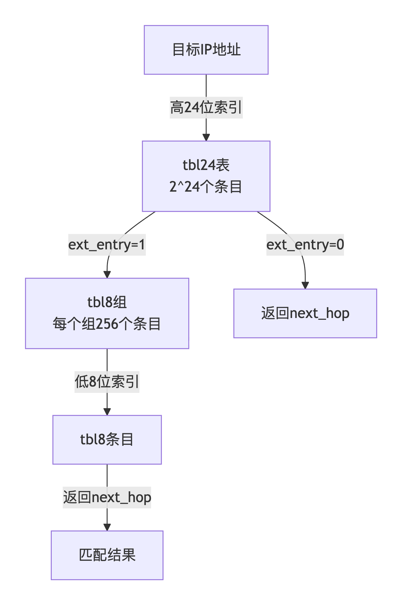

```table-of-contents
```
# 前言
在高性能网络处理中，查找算法的效率直接决定了系统的整体性能。无论是交换机中的MAC地址查找、路由器中的IP路由匹配，还是防火墙中的ACL规则检索，都需要在纳秒级的时间内完成百万级数据的精确定位。DPDK作为数据平面开发的基石，为这些关键查找操作提供了业界领先的算法实现。
传统的查找算法往往面临着"**不可能三角**"的挑战：查找速度、内存效率和并发性能很难同时达到最优。

## 查找算法的核心挑战

DPDK查找算法的设计核心在于"**精确性与效率（性能）的平衡艺术（trade-off）**"。这一哲学体现在三个关键维度：

- **时间复杂度的权衡**：如何在最坏情况和平均情况之间找到最优平衡点。
- **空间复杂度的优化**：如何在内存使用和查找性能之间进行智能取舍。
- **并发性能的保证**：如何在多核环境下保持高效的查找性能。

# 背景
在DPDK中，实现了两种路由匹配算法：
- 精确匹配（EM: exact Match）
- 最长前缀匹配(LPM： Longest Prefix Match)

## 为什么需要 LPM

路由表里有 `/8`、`/16`、`/24` 等不同掩码长度的条目，对同一个 IP，可能匹配多条规则——LPM 要找的是**最长的那条**（最精确的）。
朴素方式遍历规则表是 O(N)，无法满足线速要求。

**LPM（Longest Prefix Match）** ：是基于 CIDR 的路由匹配算法，当数据包的 `dstIP` 地址和 `Route table` 中前缀最长的 `IP/Netmask` 匹配时，找到下一跳。

# Linux内核中的路由表
## 基本概念
### 路由的组成
路由由三元素组成：目标地址，掩码，下一跳。注意，路由项中其实没有输出端口-它是链路层概念，Linux操作系统将路由表和转发表混为一谈，而实际上它们应该是分开的(分开的好处之一使得MPLS更容易实现)。

### 路由表项加入内核
路由项通过两种途径加入内核，一种是通过用户态路由协议进程或者用户静态配置配置加入，另一种是主机自动发现的路由。所谓自动发现的路由实际上是“发现了一个路由项和一个转发表”，其含义在主机某一个网卡启动的时候生效，比如eth0启动，那么系统生成下列路由表项/转发项：往eth0同一IP网段的包通过eth0发出。


## 路由表的查找
### Linux的哈希查找算法

这是Linux操作系统的经典的路由查找算法，直到现在还是默认的路由查找算法。然而它很简单。由于它的简单性，内核(kernel)开发组一直很推崇它，虽然它有这样那样的局限性，但由于Linux内核的哲学就是“够用即可”，因为Linux几乎从来不被用于专业的核心网络路由系统，因此哈希查找法一直都是默认的选择。

#### 查找过程

查找结构如下图所示：


为了实现最长前缀匹配，从最长的掩码开始匹配，每一个掩码都有一个哈希表，目的IP地址哈希到这些哈希表的特定的桶中，然后遍历其冲突链表得到最终结果。

     注意，哈希查找算法是基于掩码的遍历来实现严格的最长前缀匹配的，也就是说如果一条最终将要通过默认网关发出的数据报，它起码要匹配32次才能得到结果。这种方式十分类似于传统的Netfilter的filter表的过滤方式-一个一个尝试匹配，而不像HiPac的过滤方式，是基于查找的。接下来我们会看到，高性能的路由器在查找路由的时候使用的都是基于查找型数据结构的方式，最常用的就是查找树了。

#### 局限性

我们知道，哈希算法的可扩展性一直都是一个问题，一个特定的哈希函数只适合一定数量的匹配项，几乎很难找到一个通用的哈希函数，能够适应从几个匹配项到几千万个匹配项的情形，一般而言，随着匹配项的增加，哈希碰撞也会随着增加，并且其时间复杂性不可控，这是一个很大的问题，这个问题阻止了哈希路由查找算法走向核心专用路由器，限制了Linux路由的规模，它根本不可能使用哈希来应对大型互联网络或者BGP之类的域间路由协议产生的大量路由信息。

 核心路由器上，使用哈希算法无疑是不妥的，必定需要找到一种算法，使得其查找的时间复杂度限制在一个范围。我们知道，基于树的查找算法可以做到这一点，实际上，很多的路由器都是使用基于树的查找算法来实现的。我们先从Linux的trie树开始。便于查阅代码(虽然本文不分析代码...)。


# DPDK LPM 介绍

DPDK LPM（Longest Prefix Match）库是一个高性能的前缀路由匹配库，用于在数据包转发过程中快速查找与 dstIP 地址最长匹配的路由表项。

DPDK中的LPM实现**综合考虑了时间和空间问题**，做了一个比较好的折中，将32位的地址空间分为两部分：
- 高24位
- 低8位

这是专门针对路由表查询设计的数据结构。通过这种方式，**将IP地址空间分为二级表的方式进行查询。** 
(1) 前缀的24位共有2^24个条目(16x1024x1024个)，也就是说IP地址的前三个字节对应的数值在表中存在一一对应项。
(2) 低8位的256个条目可以根据需求进行分配；
这样可以**极大的节省空间**。

经过有关部门的统计分析，**路由表项的IP掩码长度绝大多数是小于等于24位的，因此这部分可以通过一次内存访问便可以找到对应的路由；当查找的IP掩码长度超过24时，需要两次访问内存，而这种情况相对较少**。因此，DPDK实现的LPM算法兼顾了时间和空间效率。


# DPDK LPM设计原理：空间和时间的权衡

DPDK 的 LPM（最长前缀匹配）专为 IPv4 路由查找设计，核心采用 **DIR-24-8 算法**（两级表结构），用空间换时间，**绝大多数查询只需 1 次内存访问**，超长掩码（>24 位）需 2 次，性能极高。

- 32 位 IPv4 地址拆为 **高 24 位 + 低 8 位**
- 一级表 `tbl24`（2²⁴=16M 项）：用前 24 位索引
- 二级表 `tbl8`（多组，每组 2⁸=256 项）：用后 8 位索引
- 统计规律：**路由掩码 ≤24 位占绝大多数** → 一次访存命中
- 掩码 >24 位：`tbl24` 指向 `tbl8`，二次访存

## 两级hash表
两级hash表：LPM Library 具有很好的灵活性，同时为了兼顾性能，底层实现仍是基于 HASH 算法，并且将 32bit 的 IP 地址分为 2 个部分：前24位和后8位。  
（1）前24位对应1个2^24 entries的大hash表。  
（2）后8位对应2^8个2^8 entries的小hash表。


第一张表称为tbl24，使用要查找的IP地址的前24位进行索引，第二张表称为tbl8，使用IP地址的最后8位进行索引。
这意味着，根据尝试将传入数据包的IP地址与tbl24中存储的规则进行匹配的结果，我们可能需要在第二级继续查找过程。

由于tbl24的每个条目都可能指向tbl8，因此理想情况下，我们将有2 ^ 24个tbl8，这与具有2 ^ 32个条目的单个表相同。 由于资源限制，这是不可行的。 相反，这种方法就是**利用了超过24位的路由规则非常少**的这一特性。通过将这个过程分为两个不同的表/级别并限制tbl8的数量，我们可以**大大降低内存消耗，同时保持非常好的查找速度（大部分时间仅一个内存访问）**。

### 为什么要分两级？

如果采用最朴素的做法，创建一个包含所有可能IP地址（2^32 ≈ 43亿）的完整路由表，内存消耗约为16GB（每个条目4字节），这在实践中是不可接受的。

但如果只使用一级表（2^24 ≈ 1677万条目），内存消耗约为64MB（每个条目4字节），虽然可行，但无法处理前缀长度超过24位的路由规则。

### 统计分析支撑
经过实际网络流量统计分析，路由表中前缀长度超过24位的规则占比非常小。基于这一统计特性，DPDK LPM采用了**两级表结构**：
- **一级表（tbl24）**：处理前缀长度 ≤ 24位的路由，一次内存访问完成
- **二级表（tbl8）**：处理前缀长度 > 24位的路由，需要两次内存访问

这种设计使大部分查找操作仅需一次内存访问，同时大幅降低了内存消耗


## 查找



（1）第1次查找大hash表。  
1> 匹配上非24位掩码的路由表项时返回结果。  
2> 匹配上24位掩码的路由表项后，不存在小hash表时返回结果。  

（2）第2次根据后8位查找小hash表。  
1> 匹配上时返回结果。  
2> 未匹配上时返回24位结果。


# DPDK LPM库的特点

LPM 库具有以下特点：

**高性能**：LPM 库使用基于前缀树的算法实现快速匹配。
**多核（多线程）安全**：LPM 库支持多线程并发安全，能够充分利用多核处理器的计算资源。
**灵活配置**：LPM 库支持动态配置路由表，可以在运行时添加、删除或修改路由表项，以适应网络拓扑的变化。
**内存管理**：LPM 库使用 Memory Pool 来管理内存。


# DPDK LPM路由查找算法
## 数据结构


### 查找表：tbl24条目结构
tbl24是一张包含2^24个条目的大表，每个条目的结构如下：

|字段|位宽|说明|
|---|---|---|
|**next_hop**|24位|下一跳索引，或指向tbl8组的索引|
|**valid**|1位|有效标志，表示该条目是否有效|
|**ext_entry**|1位|外部条目标志，0表示直接命中，1表示需要继续查tbl8|
|**depth**|6位|规则深度（掩码长度）|

**字段解释**：

- **next_hop**：24位字段，根据规则不同有两种含义。当规则深度≤24且ext_entry=0时，直接存放下一跳索引；当规则深度>24且ext_entry=1时，存放指向tbl8组的索引值。
    
- **ext_entry**：决定查找流程的关键标志。为0时表示查找完成，为1时表示需要到二级表tbl8中继续查找。
    
- **depth**：存储匹配到此条目的规则的掩码长度。

### 查找表：tbl8条目结构
tbl8是一组大小为2^8（256）个条目的表，每个tbl8组内部的结构如下：

|字段|位宽|说明|
|---|---|---|
|**next_hop**|24位|下一跳索引|
|**valid**|1位|有效标志，表示该条目是否有效|
|**valid_group**|1位|有效组标记，表示该tbl8组是否有效|
|**depth**|6位|规则深度（掩码长度）|

### 规则表：

## 添加LPM规则

## 查找LPM规则


## QA
### 使用数组存储，插入/删除规则是否需要移动所有规则？

## 范例
### 路由表项配置

假设我们按顺序添加以下路由：

|序号|路由前缀|掩码长度|下一跳|
|---|---|---|---|
|1|192.168.0.0/16|16|10|
|2|192.168.1.0/24|24|20|
|3|192.168.1.192/26|26|30|
|4|192.168.1.193/32|32|40|

**注意**：实际添加顺序会影响tbl24/tbl8的填充结果，但最终查找结果由**最长前缀匹配**决定，与添加顺序无关。为简化说明，假设添加顺序为16→24→26→32。

### 插入流程详解

**原则**：
- 当插入更具体的规则时，会覆盖父前缀对应的条目（tbl24或tbl8中的特定索引）
- 未被覆盖的索引仍指向父前缀

#### 插入192.168.0.0/16（深度16 ≤ 24）

- **查找表tbl24更新**：需要扩展所有匹配该前缀的24位子前缀。192.168.0.0/16的前缀范围是`0xC0A80000`（高16位），低8位任意（共256个可能性）。因此，tbl24表中索引为`0xC0A800`到`0xC0A8FF`的所有条目（共256个）都被设置为：
```bash
valid = 1, ext_entry = 0, depth = 16, next_hop = 10
```

- **tbl8**：不涉及
- **规则表**：在depth=16组中添加规则`(ip=0xC0A80000, depth=16, next_hop=10)`

此时tbl24表部分状态：
```bash
索引0xC0A800(192.168.0): (valid=1, ext=0, depth=16, next_hop=10)
索引0xC0A801(192.168.1): (valid=1, ext=0, depth=16, next_hop=10)
...
索引0xC0A8FF(192.168.255): (valid=1, ext=0, depth=16, next_hop=10)
```

#### 插入192.168.1.0/24（深度24 ≤ 24）

- **查找表tbl24更新**：该前缀对应的单个tbl24索引为`0xC0A801`（因为高24位就是192.168.1）。但此条目当前已被/16规则设置为有效且depth=16。插入/24规则时，需要**覆盖**更长的前缀：将`tbl24[0xC0A801]((192.168.1))`更新为：
```bash
valid = 1, ext_entry = 0, depth = 24, next_hop = 20
```
- 注意：这并不会影响`tbl24[0xC0A800](192.168.0~192.168.255, 中间刨去 192.168.1)`等其他索引，它们仍指向/16路由。

- **规则表**：在depth=24组中添加规则`(ip=0xC0A80100, depth=24, next_hop=20)`

此时tbl24表状态：
```bash
tbl24[0xC0A800](192.168.0): (1,0,16,10)
tbl24[0xC0A801](192.168.1): (1,0,24,20)   // 被/24覆盖
tbl24[0xC0A802](192.168.2): (1,0,16,10)
...
tbl24[0xC0A8FF](192.168.255): (1,0,16,10)
```

#### 插入192.168.1.192/26（深度26 > 24）
由于深度大于24，需要分配tbl8组：

- **确定父前缀**：父前缀是192.168.1.0/24（因为26位掩码的前24位与/24相同）
    
- **`检查tbl24[0xC0A801]`**：当前条目是`(1,0,24,20)`，ext_entry=0。由于需要支持更具体的/26规则，必须将其改为指向tbl8组：
    
    - 分配一个新的tbl8组（假设组索引为`tbl8_group_0`）
        
    - 初始化该tbl8组的256个条目，默认填充为父前缀的信息：`(valid=1, depth=24, next_hop=20)`
        
    - 将`tbl24[0xC0A801](192.168.1)`修改为：
```bash
valid = 1, ext_entry = 1, depth = 24, next_hop = tbl8_group_0
```

**设置查找表tbl8组中的/26条目**：/26掩码意味着低8位中的高2位固定（因为26-24=2位）。192.168.1.192的二进制表示：192 = `11000000`，高2位为`11`。因此需要设置tbl8组中索引从`192`到`255`的连续64个条目（因为低6位任意）。设置这些条目为：

```bash
valid = 1, depth = 26, next_hop = 30
```

- **规则表**：在depth=26组中添加规则`(ip=0xC0A801C0, depth=26, next_hop=30)`

此时查找结构：
```bash
tbl24[0xC0A801](192.168.1) -> ext_entry=1, next_hop=tbl8_group_0

tbl8_group_0[0..191]   : (valid=1, depth=24, next_hop=20)   // 继承自/24
tbl8_group_0[192..255] : (valid=1, depth=26, next_hop=30)   // /26覆盖
```

#### 插入192.168.1.193/32（深度32 > 24）
- **父前缀**：父前缀是192.168.1.192/26（因为32位掩码的前26位与/26相同）
    
- **tbl8组已存在**：`tbl24[0xC0A801]`已经指向`tbl8_group_0`
    
- **设置tbl8条目**：/32掩码意味着低8位完全固定。IP 192.168.1.193的低8位是193（`11000001`）。在tbl8组中索引193当前属于/26范围（192-255），需要覆盖为更具体：将`tbl8_group_0[193]`更新为：
```bash
valid = 1, depth = 32, next_hop = 40
```
注意：其他索引如194-255仍保持/26的next_hop=30。

- **规则表**：在depth=32组中添加规则`(ip=0xC0A801C1, depth=32, next_hop=40)`

最终tbl8_group_0状态：
```bash
---------- : (valid, depth, next_hop)
索引0-191   : (1,24,20)
索引192     : (1,26,30)
索引193     : (1,32,40)   // 被/32覆盖
索引194-255 : (1,26,30)
```

### 查找流程详解
```bash
目标IP: 192.168.1.193 (0xC0A801C1)
┌─────────────────────────────────────────────────────────────┐
│ 高24位: 0xC0A801(192.168.1)                                  │
│         │                                                   │
│         ▼                                                   │
│   tbl24[0xC0A801] ──┬── ext_entry=1?  ──Yes──┐             │
│                     │                        │             │
│                     └── No (深度≤24) ──返回next_hop │             │
│                                                ▼             │
│                                      next_hop = tbl8_group_0 │
│                                                │             │
│ 低8位: 0xC1 (193)                           │             │
│         │                                   │             │
│         └──────────────► tbl8_group_0[193] ─┴─ 返回next_hop=40
└─────────────────────────────────────────────────────────────┘
```

#### 查找192.168.1.193（目标IP = 0xC0A801C1）

1. **提取高24位**：0xC0A801 → 索引`tbl24[0xC0A801]`
    
2. **检查tbl24条目**：`ext_entry=1`，所以需要查找tbl8
    
3. **提取低8位**：0xC1 (193)
    
4. **tbl8组索引**：`tbl8_group_0[193]`
    
5. **读取tbl8条目**：`(valid=1, depth=32, next_hop=40)`
    
6. **返回next_hop=40** ✓

**匹配结果**：/32规则（最长前缀）

#### 查找192.168.1.197（目标IP = 0xC0A801C5）

1. **高24位**：0xC0A801 → `tbl24[0xC0A801]` → `ext_entry=1`
    
2. **低8位**：0xC5 (197)
    
3. **tbl8_group_0[197]**：此索引属于194-255范围，该条目为`(1,26,30)`
    
4. **返回next_hop=30** ✓
    
**匹配结果**：/26规则（197位于192-255范围内，但不是特定的/32）

#### 查找192.168.2.2（目标IP = 0xC0A80202）

1. **高24位**：0xC0A802 → `tbl24[0xC0A802]`
    
2. **tbl24条目**：该索引在插入/16时已被填充，状态为`(1,0,16,10)`，`ext_entry=0`
    
3. **直接返回next_hop=10** ✓
    

**匹配结果**：/16规则（没有更具体的/24或/26覆盖此地址）

#### 查找192.168.1.5（目标IP = 0xC0A80105）

4. **高24位**：0xC0A801 → `tbl24[0xC0A801]` → `ext_entry=1`
    
5. **低8位**：0x05 (5)
    
6. **tbl8_group_0[5]**：索引5属于0-191范围，该条目为`(1,24,20)`
    
7. **返回next_hop=20** ✓

**匹配结果**：/24规则（5在/24范围内，但没有更具体的/26或/32覆盖）

### 删除流程详解

**删除时的回退**：
- 删除规则后，被覆盖的索引需要恢复为次长前缀（即仍然存在的、掩码长度最长的父前缀）
- 这需要遍历规则表寻找可用的父前缀，时间复杂度O(depth)，但删除操作频率远低于查找，可接受


以删除192.168.1.193/32为例：
1. **规则表删除**：在depth=32组中找到该规则，将其与组内最后一条规则交换，然后删除。
    
2. **查找表更新**：需要确定删除/32后，tbl8_group_0[193]应该回退到什么值。
    
    - 检查是否存在比/32更具体的规则？没有（/32是最大深度）
        
    - 检查是否存在父前缀？父前缀是/26（192.168.1.192/26）
        
    - 因此，将`tbl8_group_0[193]`恢复为父前缀的信息：`(valid=1, depth=26, next_hop=30)`
        
3. **注意**：删除/26或/24规则时，需要遍历其覆盖的所有tbl8条目或tbl24条目，将它们恢复为更通用的父前缀。例如删除192.168.1.0/24：
    
    - 将`tbl24[0xC0A801]`的ext_entry改回0，next_hop恢复为父前缀/16的10
        
    - 释放tbl8_group_0（如果没有其他规则使用该tbl8组）


# 参考
```bash
# DPDK源码学习之 LPM路由匹配算法
https://zhuanlan.zhihu.com/p/613702218
```