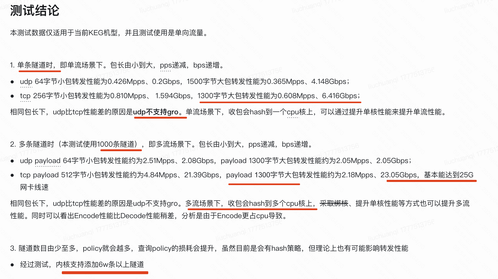
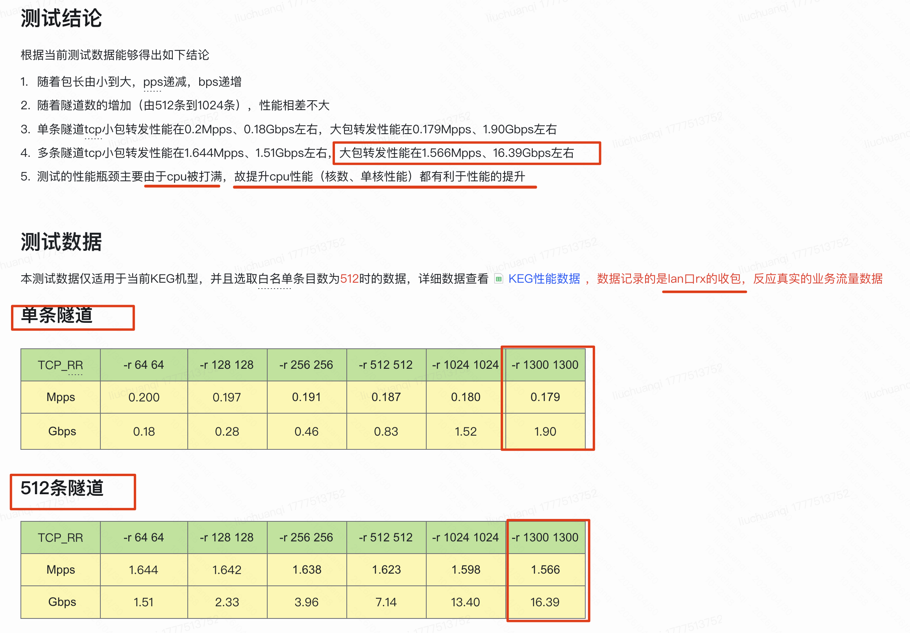

```table-of-contents
```
# 概述
# 背景
边缘计算机房特点是规模普遍较小、分散广、建设周期短，一般内网只能机房内互通，没有专线所以无法与IDC互通；因此业务将服务下沉至边缘，有这些痛点：
● 无法在边缘使用公司内部基础组件（如管控平台，监控，公司内yum源等），且推动各组件支持外网改造难度大、周期长；
● 业务自身有部分服务部署在IDC，需要改造成走外网，适配成本高；
● 海外部署场景，业务需要与国内IDC互通，连接被“墙”；
所以无论从短期业务发展和长期网络规划来看，网络层面支持边缘和
IDC的互通是支撑业务发展的强需求；
# KEG
.png)
加速接入点（KEG），主要部署在第三级CDN节点；
（1）边缘节点到加速接入点（KEG）通过ipsec连通，
（2）加速接入点（KEG）到内网服务器通过专线连通，

- 由于当前边缘节点大部分在公有云，包括阿里云，腾讯云，以及海外aws，google等，并且边缘节点的服务器数量非常少，一般2-3台云主机。
- 采用在边缘节点放置边缘网关的方案，边缘计算部门评估反馈成本较高，当前不能接受这种方案，未来等边缘节点做大之后可以采用独立网关的方案

.png)
.png)

## 方案

|隧道方案|优缺点|措施|
|---|---|---|
|gre|缺点：不可加密，外网安全性较低|不满足要求|
|vxlan|缺点：不可加密，一般用内网，外网安全性较低<br><br>优点：相对通用，技术成熟|不满足要求|
|ipsec|缺点：<br><br>    开源方案，IKE SA/IPSEC SA状态协商复杂，IKE密码系统复杂，CPU开销大，只能采用主备模式<br><br>优点：<br><br>  支持加密，开源方案成熟。SDWAN，CloudVPN等方案大量使用|采用Scale out的设计思路，打破IPSEC的性能局限。通过以下三个具体方案，来确保Scale out的思路能够落地<br><br>1. 转发面无状态。只采用IPSEC的隧道转发面开源方案，采用静态方式建立无状态隧道，避免产生会话，以建立转发面scale out的能力<br>    <br>2. 密码系统无状态。采用静态对称加密算法，避免IKE的会话产生，以确保scale out的能力<br>    <br>3. 自研密码分发系统，采用控制器系统来集中控制更新。避免产生有状态的会话，集群化提升可靠性和性能|

### ip xfrm  内核的ipsec能力
ip xfrm  内核的ipsec能力：


.png)
```bash
边缘到keg: decode , 然后 fwd policy;  policy 和 state必须都要走到匹配。
keg 到边缘：out policy, 然后 encode；
```

#### esp封装、解封装和tcpdump的先后关系

.png)

#### 收包

（1）存在 esp_offload + gro:
	tcpdump看不到esp包，看到的是解封装之后的包。

（2）不存在 esp_offload + gro:
	tcpdump可以看到esp包，以及解封装之后的包。

注：esp_offload 需要和GRO配合使用，收包方向，对于大块数据进行解密。发包方向，没有作用。

#### 发包

如上所示，发包而言，taps是tcpdump的发包位置。
tcpdump在封装之后，即tcpdump看到的是ESP封装之后的包。看不到原始包。

### ipsec隧道配置

内核里，配置ipsec分两部分，state(sa)和policy（sp）。

state是隧道相关的配置，policy（ACL规则）是哪些流量可以进出隧道。
state的配置需要通信的两端一致。并且一个state是个单向的，要实现双向通信，需要配置两个state。一个state的唯一key是dip/spi/proto。我们只用esp协议，proto是固定的，因此唯一key是dip和spi。KEG的接收端（边缘到KEG）的state，dip只能是vip，因此唯一key只有spi。spi是一个32bit的整数。

### 路由设计
双口上下联部署
wan口发布vip用于建立ipsec隧道；
lan口发布边缘网段路由；

#### 业务流量路由
业务流量：
- lan 口入向流量走 forward，打上 hash mark 后转发，匹配 policy 后加密 (打上 mark 0x300， )，从 wan 口发送出去（查找 table 300）
- wan 口入向流量 走 input 解密 （打上 mark 0x400），后再走 forward 从 lan 口发送出去（查找 table 400）
    
#### 探测流量路由
探测流量：
- wan 口入向流量走 input 解密（打上mark 0x400），后再走 input 上送
- 出向流量走 ouput 链加密（打上 mark 0x300），从 wan 口发送出去（查找 table 300）

### 隧道设计
隧道流量有两类：业务流量和探测流量
（1）业务流量
- 隧道外层源ip为本端KEG vip，外层目的ip为对端KEG vip，具体对应下文详述；
- 隧道内层源ip为本端业务ip，内存目的ip为对端业务ip；
- 隧道policy，出向policy指向对端业务网段，入向policy全部接收；

（2）探测流量
- 隧道外层源ip为本端KEG vip，外层目的ip为对端KEG vip，与业务流量相同；
- 隧道内层源ip为本端KEG管理口ip，内层目的ip为对端KEG vip；
- 隧道policy，出向policy指向对端KEG vip，入向policy全部接收；

### KEG的隧道和密码
1. 每条隧道对应独立密码
2. 定期生成新密码并分发新密码到KEG网关和边缘节点    
3. 密码下发到KEG，KEG负责新建隧道并替换旧隧道，负责新隧道的探测

### 隧道的密钥更新
（1）使用对称加密

**去掉了非对称加密的密钥协商，使用的是对称加密**，因为keg集群，使用vip。keg集群中的各个keg机器的密钥都相同。
如果集群中各个keg都使用一组相同的vip，但是有协商的话，单个边缘机器，只能和单个keg协商，因为基于外层的二元组hash，永远到达一个keg设备，但是keg集群的扩缩容会导致有问题。

(2) 更新流程

A》创建新的隧道。
用新的spi和密码创建隧道，新旧隧道同时存在
B》创建policy，将探测流量指向新的隧道。
源IP是lan_ip  目的IP是对端内网IP。这样就相当于是IDC内网访问边缘，可以匹配到Policy规则，以及进行隧道封装。
C》探测新的隧道
用lan ip ping对端内网IP
4》更新policy，指向新的隧道
发送的policy，更新到新隧道的spi。接受的policy忽略spi，不需要更新。
5》删除旧的隧道
隧道探测成功之后，10s之后，如果旧的隧道没有流入的流量，就删除旧的隧道。如果超过10分钟仍然有流量，推送异常报警到监控平台。

### 隧道探测
.png)

集群内的每个网关独立探测，从每个网关到边缘的路径都可以探测到。通过ping的方式进行探测。

(1) SIP

用本机lan ip进行探测。

(2) DIP

ping对端公网IP，并将流量导到隧道。

由于是集群模式，应答包可能不会直接回到发送的网关，接收到应答的网关会转发到发起的网关上。

(3) 从边缘到集群的探测

从边缘到集群的探测，需要边缘节点发起。只能探测到一个网关的链路，并不会影响切换，因为非探测的流量也不会到其他的网关。探测成功之后，就可以切换隧道了。

  
（4）密钥切换时期，policy以及state(sa)的选择以及匹配

对于内核版本的 IPsec(边缘版本和支付版本)，在控制面发送探测报文时，是通过将socket绑定到某个policy，进而匹配sa；而不是通过探测报文的dip来匹配policy，进而匹配sa。

这个是因为 隧道的密钥切换时，需要新的隧道探测正常之后，才可以进行切换。而新的隧道的探测成功，需要将之前的policy的value设置为新的sa的spi才可以。

### 白名单设计

（1）对于边缘KEG版本，存在白名单设置。

KEG收到边缘节点的ipsec封装报文之后，先进行解封装；然后再进行白名单匹配，白名单支持sip以及dip的匹配，目前设置的是将多个dip封装为ipset，然后通过iptables 的filter来进行过滤。

即：允许边缘的kes访问idc的哪些设备以及服务。

  

（2）对于支付版本以及DPDK版本

DPDK版本其实是为了支付版本进行开发的，支付版本的流量可能相对较大，都是IDC内的加密互通，则默认都是放开的。即不存在白名单，默认都是放开的。


## 性能
基于内核 ip xfrm 版本的ipsec的性能数据如下所示：

ip xfrm的性能主要受限于CPU，提升单核的CPU性能，以及增加处理IPsec流量的CPU个数，都可以提升性能。

### 单向测试：只打单向流量
#### 测试方法
在一端使用hping/iperf进行打流, 另外一端接收但是不响应，通过sar -D 查看网卡的流量。

#### 结论


单条隧道时（只能匹配到一个CPU核），开启GRO时，打TCP 1300B的大包，Rx bps 6.4G, Rx pps 0.6M；
多条隧道时（可以多个CPU核处理）开启GRO时，打TCP 1300B的大包，Rx bps 23G, Rx pps 2M， 基本达到25G限速。

（1）单隧道：对应单核
.png)
.png)

（2）多隧道：对应多核
.png)
%202.png)

### 双向测试：打双向流量
#### 测试方法
测试拓扑如下图，采用2打2的拓扑，两台client端（bjrz-k411.lf、bjrz-k267.lf）打两台server端（bjrz-k400.lf、bjrz-k433.lf），中间经过keg设备（bjrz-k536.lf）的转发。从client发出的是加密报文，经过keg设备的解密后转发到server上，同时server回包经过keg设备的加密后，再转发到client设备上。

%202.png)


#### 测试结论



根据当前测试数据能够得出如下结论
1. 随着包长由小到大，pps递减，bps递增
2. 随着隧道数的增加（由512条到1024条），性能相差不大
3. 单条隧道tcp小包转发性能在0.2Mpps、0.18Gbps左右，大包转发性能在0.179Mpps、1.90Gbps左右
4. 多条隧道tcp小包转发性能在1.644Mpps、1.51Gbps左右，**大包（1300B）转发性能在1.566Mpps、16.39Gbps左右**
5. 测试的性能瓶颈主要由于**cpu被打满，故提升cpu性能（核数、单核性能）** 都有利于性能的提升


# EVB
.png)
.png)


# 总结
