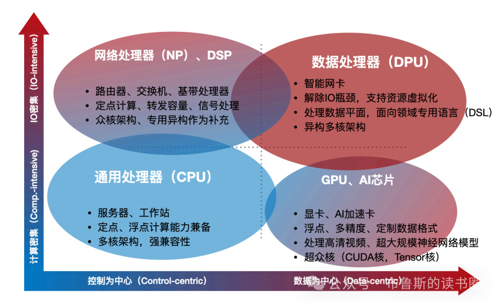
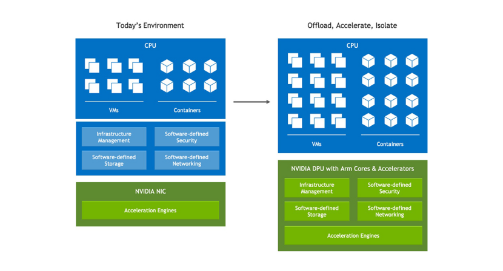
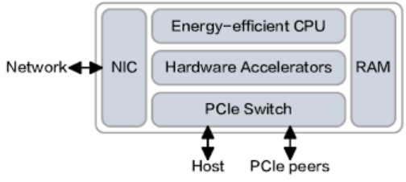
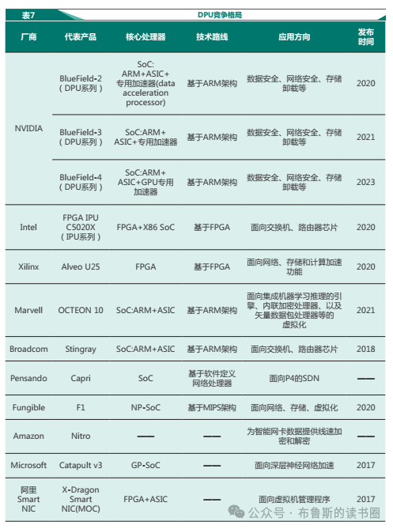

```table-of-contents
```
# DPU简介

## 什么是DPU
DPU是**Data Processing Unit**的简称，即数据处理器，是一种**专用的可编程多核处理器**，其本质是一个高度集成的片上系统（SoC）。是一种专门用于处理**数据中心**中 **数据流动与基础设施任务**的专用处理器。

  

（1）DPU（Data Processing Unit）是以数据为中心构造的专用处理器，采用软件定义技术路线支撑基础设施层资源虚拟化，支持存储、安全、服务质量管理等基础设施层服务。（来自中国科学院计算技术研究所发布的《专⽤数据处理器 (DPU)技术白皮书》）
（2） DPU 从本质上来看，均是一种**围绕数据处理**提供网络、存储、安全、管理等数据中心基础设施虚拟化服务的专用处理器，**基于 ARM/X86 等架构的 CPU** 与 **ASIC（Application Specific IntegratedCircuit） /NP（Network Processor） /FPGA（Field Programmable Gate Array）等专用硬件加速引擎**组成的计算架构，形成提供虚拟化功能的实体。（来自《中国移动 DPU 技术白皮书》）


DPU是面向基础设施层的数据处理单元。鉴于此，Intel也把自己的DPU称之为“IPU”。那么所谓的基础设施层，是有别于应用层而言的，是为了给予应用提供物理或虚拟化资源，甚至提供基础服务的逻辑层。其实这个概念很好理解，从我们先有的计算系统的宏观逻辑层次来看，本身就被人为的分为基础设施层（IaaS），平台层（PaaS），软件层（SaaS），最上层就是应用层。如果微观来看，就会更清晰了。基础层主要包括与硬件资源交互、抽象硬件功能的组件，包括的网络，存储，服务器等。从优化技术的侧重点来看，越基础层的组件越倾向于以性能优先为导向，存在更多的“机器依赖（Machine-dependent）”，越上层的优化越以生产效率为导向，通过层层封装，屏蔽底层差异，对用户透明。


总的来说，==DPU是**以数据为中心**的结构，从形态上来说，是一种**专用的可编程多核处理器**，其本质是一个高度集成的片上系统（SoC）。从功能上来说，是一种**把原本由软件实现的网络、存储、安全等功能卸载到芯片上后形成的处理器**==。

## 为什么需要DPU

英伟达首席执行官黄仁勋曾在演讲中表示：“ DPU 将成为未来计算的三大支柱之一，未来的数据中心标配是**CPU + DPU + GPU。CPU 用于通用计算， GPU 用于加速计算， DPU 则进行数据处理**。”

它是近几年发展起来的专用处理器，是CPU、GPU之后，数据中心场景中的第三颗重要的算力芯片，为诸如云平台等需要高带宽、低延迟、数据密集的计算场景提供计算能力。

**DPU在物理上体现为一个插在主机上的PCIe设备，通过PCI总线与主机进行交互**。
DPU存在一个**ARM架构的片上系统(SoC)， 即CPU，SoC上可运行基础的Linux**，如此类似OVS这样的云平台中的支撑组件则不必运行在主机中，而是运行在DPU的SoC上。这样主机上的CPU则可专注于处理客户的计算任务，使得CPU能够发挥其最大的计算能力为客户提供服务。

### 传统的冯诺依曼架构


众所周知，自从计算机诞生以来，就是采用的著名的冯诺依曼架构。

这是一个以计算和存储为核心的架构， CPU 作为处理器单元，负责完成各种算术和逻辑计算。而内存（运存）和硬盘（外部存储），负责存储数据，与 CPU 交互。

除了 CPU 、内存和硬盘之外，就是键盘、显示器这样的输入和输出设备。随着时间的推移，后来，我们有了鼠标，又有了显卡、网卡。最终，形成了现在大家看到的电脑的基本构造。

有了显卡，就有了 GPU（Graphics Processing Unit），图形处理器。大家都玩过游戏，很明白，正是游戏、 3D 设计等多媒体图形软件的高速发展，要处理的工作量越来越大，也越来越复杂， CPU 实在忙不过来，所以就有了专门进行图像和图形相关运算工作的 GPU ，分担 CPU 的压力。

DPU 的出现，道理也是一样的。同样是因为 CPU 难以负担一些复杂的计算，所以需要进行任务分工。DPU 的出现，道理也是一样的。

总结就是：**GPU/DPU 的出现，同样是因为 CPU 难以负担一些复杂的计算，所以需要进行任务分工**。

### 系统瓶颈从带宽 转入到CPU（带宽性能增速比失衡）

DPU的出现首先要解决的就是网络数据包处理的问题。传统来看，2层网络的数据帧是网卡来处理，由CPU上运行的OS中的内核协议栈来来处理网络数据包的收发问题。这个开销在网络带宽比较低的时候，不是大问题，甚至中断开销都可以接受。但是，随着核心网、汇聚网朝着100G、200G发展，接入网也达到50G、100G时，CPU就无法再提供足够的算力来处理数据包了。我们发现了一个现象，称之为“性能带宽增速比失调”，简单理解就是CPU性能由于摩尔定律的放缓，性能增速也随之放缓，但是网络带宽的增速来自于应用的丰富，数据中心规模的扩大，数字化进展的驱动，所以增速反而更加的迅速，这就进一步加剧了服务器节点上CPU的计算负担。

在云计算加速普及的当下，通信能力和计算能力是数据中心基础设施的两个重要发展方向，随着网络传输带宽的增加，数据中心的计算资源被愈加复杂的基础设施操作所占据，使得业务处理遭遇瓶颈。

据《专用数据处理器（DPU）技术白皮书》，业界常用带宽性能增速比（RBP，Ratio of Bandwidth and Performancegrowth rate）对网络带宽增速与CPU性能增速进行描述，即RBP=BWGR/Perf. GR。

RBP指标 2010年的数值1，到2021年数值超过10，CPU几乎已经无法直接应对网络带宽增速，因此DPU本质源于网络传输速率增速与CPU芯片性能增速差距加大。

### CPU算力有一部分消耗在基础设施任务

传统的云计算主机上，CPU除了负担客户购买的计算能力之外，还需要负担云平台中必要的支撑组件的运行，典型例子如**云平台VPC网络数据转发平面的常见组件OVS**。

一般场景下，OVS运行在云计算主机上，基于VXLAN技术实现云平台VPC网络。在转发网络数据包的过程中，需要处理大量的计算工作，如**流表匹配，数据包的封装与解封，checksum计算**等，这些工作必然要消耗云主机大量的CPU资源。这不仅浪费了昂贵的计算资源，还带来了延迟增加、性能波动等问题。

那么是否可以有一个额外的处理单元，替CPU分担这些支撑组件的运行工作呢？DPU就是这个额外的处理单元。

## DPU的目标

DPU 的核心目标是：把原来由服务器 CPU 负责的基础设施任务卸载出去。
例如：
- 网络协议处理（TCP/IP）
- RDMA
- NVMe-oF
- VXLAN
- IPSec/TLS
- 存储虚拟化
- Kubernetes网络
- 安全防火墙


# CPU & GPU & DPU的对比


**通用CPU**是偏向于**以控制为中心，要支持完备的指令集**；通过编程指令序列来定义计算任务，通过执行指令序列来完成计算任务，因此具备极其灵活的编程支持，用可以任意定义计算的逻辑来实现“通用”——这也是CPU最大的优势。

GPU是**以数据为中心**的结构，形式上更倾向于**专用加速器**。GPU的结构称之为数据并行（data-parallel）结构，优化指令并行度并不是提升性能的重点，通过**大规模同构核进行细粒度并行**来消化大的数据带宽才是重点。

DPU也偏向于**数据为中心**的结构，形式上集成了更多类别的专用加速器，牺牲一定的指令灵活性以获得更极致的性能。但是与GPU不同，DPU要应对更多的网络IO，既包括外部以太网，也包括内部虚拟IO，所以DPU所面临的数据并行更多可能是**数据包/IO并行**，而不是图像中的像素、像块级并行。DPU更偏向于**以数据为中心，执行IO密集任务**。



上面这幅图用两个维度区分各种处理器。
第一个维度是设计处理器架构时，是以控制为中心（包括CPU）还是以数据为中心（包括DPU和GPU）。
第二个维度是在处理器上运行的应用，属于计算密集型（适合CPU和GPU）还是IO密集型（适合DPU）。

所以**DPU是用来帮助CPU处理以数据为中心的IO密集型任务**。


## 小结


DPU与CPU的通用计算和GPU的并行计算不同，DPU的核心设计理念聚焦于**卸载（Offload）、加速（Accelerate）和隔离（Isolate）**。
在现代数据中心中，CPU主要承担通用业务逻辑和复杂控制任务；
GPU专注于高吞吐的并行计算（如AI训练与科学模拟）；
==DPU专门负责将原本由CPU处理的基础设施任务，包括网络数据包处理、存储I/O路径、虚拟化开销、加密解密、安全策略执行等，从主机处理器中剥离出来，在专用硬件上高效完成==。

通过这种分工，DPU不仅显著**降低了CPU的负载**、提升了系统整体性能，还实现了**基础设施功能与业务应用之间的硬件级隔离**，增强了系统的安全性与可靠性。
简言之，DPU让CPU和GPU能够更专注地处理其核心计算任务，从而提升整个数据中心的效率与可扩展性。

# DPU的发展历程
DPU的诞生并非一蹴而就，而是数据中心网络设备长期演进的结果，其发展历程大致可分为三个阶段：
  
阶段一：基础网卡（NIC，Network Interface Card）----> 阶段二：智能网卡（SmartNIC）---->  阶段三：数据处理器（DPU）.

## 阶段一：基础网卡（NIC，Network Interface Card）

这是最原始的网络接口设备，其唯一功能就是作为服务器与网络之间的物理连接管道，负责收发数据包。所有网络协议栈（如TCP/IP）的处理、虚拟化网络的构建（如OVS）等工作，全部由服务器的CPU承担。在数据量和网络速率不高的时代，这种模式尚可应付。

## 阶段二：智能网卡（SmartNIC）

随着云技术和网卡带宽的不断增加，原有由CPU执行的网络数据包封装、解析之类的工作量越来越大，**CPU芯片的相当一部分核都去用来处理网络数据了，能提供给云用户的处理器就越来越少**。

云服务的开发商为了赚钱就有动力将网络数据包处理服务卸载到网卡上，以提供更多的处理器核给用户使用。这样就出现了最初的智能网卡。为了给CPU减负，智能网卡应运而生。它**在传统网卡上集成了一些固化的硬件加速引擎或灵活的FPGA，可以将部分标准化的数据平面任务（如RDMA、VXLAN封装/解封装）从CPU卸载，从而释放CPU算力**。
Mellanox（后被NVIDIA收购）是推广智能网卡概念的先驱。

## 阶段三：数据处理器（DPU）

智能网卡虽然能卸载部分数据平面任务，但对于更复杂的控制平面任务、非标准协议处理以及新兴的应用场景（如裸金属虚拟化、分布式防火墙），其能力仍然有限。

DPU正是在智能网卡的基础上，通过**集成强大的多核CPU和更丰富的硬件加速器**，实现了质的飞跃。DPU不仅能高效处理数据平面，还能独立运行一个完整的操作系统，**处理原本需要由主机CPU执行的控制平面任务（主要是各类管理任务、隔离、计费、安全检测）**，如虚拟化管理、安全代理、存储管理等。

DPU最初是由智能网卡演变而来的。可以认为DPU是智能网卡的升级，因此DPU延续了智能网卡“释放CPU开销”、“可编程”、“任务加速”、“流量管理”等功能，并实现了控制面和数据面的通用可编程加速。

Fungible最先于2016年提出DPU的概念，也是第一家专注于设计DPU的创业公司。

Mellanox在2019年率先推出了基于**BlueField的DPU**，后Nvidia于2020年收购Mellanox，同年提出BlueField 2.0 DPU，自此，DPU开始活跃起来，并吸引了大量国内外知名创业公司的加入。

国外公司的典型代表有Marvell、Pensando（波塞冬）、Broadcom、Intel，国内的公司集中在创业团队，他们凭借自身的技术积累入局DPU，如中科驭数、星云智联等。

2021年Nvidia推出了基于BlueField 3.0的DPU。


# DPU的工作内容

## DPU的角色类似于CPU的“小秘书”

CPU 内核是为通用应用程序处理而设计的，随着网络速度的提高（现在每条链路的速度高达 200gb / s ）， CPU 花费了太多宝贵的内核来分类、跟踪和控制网络流量。


主机将一些需要重复计算或者计算量大的杂活、累活卸载给DPU进行处理。通过DPU的方式就可以解决网络传输中的瓶颈问题或丢包问题。典型通信延时可以从30-40微秒降低到3-4秒，性能提升10倍以上。

DPU专门负责==将原本由CPU处理的**基础设施任务**，包括网络数据包处理、存储I/O路径、虚拟化开销、加密解密、安全策略执行等，从主机处理器中剥离出来，在专用硬件上高效完成==。

通过这种分工，DPU不仅显著降低了CPU的负载、提升了系统整体性能，还实现了基础设施功能与业务应用之间的硬件级隔离，增强了系统的安全性与可靠性。
> **DPU是用来帮助CPU处理以数据为中心的IO密集型任务**。

**DPU有自己的处理单元（基于ARM的CPU）和硬件设备**，前面提到的加密和虚拟交换等通常使用软件实现，并在CPU里运行。而DPU可以使用硬件实现并运行这些支撑组件，这样比在CPU运行要快好几个数量级，这也就是我们常常会听到的**硬件加速**。
此外，由于将**支撑组件**运行在了DPU中的基于ARM的CPU中，而客户的应用则在CPU里运行，这样就把二者隔离开了，会带来很多安全和性能上的好处。

## DPU在卸载（Offload）、加速（Accelerate）和隔离（Isolate）方面的应用



DPU的核心设计理念聚焦于**卸载（Offload）、加速（Accelerate）和隔离（Isolate）**。
DPU的核心价值在于将数据处理从CPU与GPU中剥离，实现高效、可扩展的数据中心架构。具体包括以下几个功能模块：

### 网络加速和卸载
DPU可以处理网络协议堆栈、分组过滤及传输调度等功能，在网络层提前处理数据包流量，从而减轻CPU网络负载，提高整体网络吞吐和延迟表现。
```bash
如前文提到的OVS虚拟交换、虚拟路由
```

### 存储访问与I/O处理
传统服务器架构中，存储I/O处理往往占用显著CPU周期。DPU可通过DMA（直接内存访问）、零拷贝等技术直接完成存储数据流的调度与转发，提升数据访问效率。
```bash
数据中心存储服务，比如RDMA、NVMe(一种远程存储技术)
```

### 安全与虚拟化隔离
DPUs支持硬件加速的安全功能，例如防火墙、加密/解密、隔离多租户流量以及支持虚拟化。通过在网络边缘执行这些任务，可以提升整个系统的安全性和可扩展性。
```bash
数据中心的安全服务，比如防火墙、加解密等等
```
# DPU架构发展
## 纯 Arm CPU 架构（第一代主流方案）
- 核心思路：用一组通用Arm Cortex-A核心（通常8-16颗）跑完整Linux系统，软件实现vSwitch（如OVS）、存储协议栈等功能，周边挂一些基础加速引擎（如简单的crypto/压缩单元）。
- 本质是"用CPU的灵活性换硬件加速的不足"，软件可编程性最强，但很多功能本质上是软件转发，性能天花板较低。
- 代表：NVIDIA BlueField早期型号、Marvell的部分OCTEON方案。

## FPGA + CPU 架构
后来出现 FPGA SmartNIC。

```bash
            ┌────────────┐
            │ Arm/x86 CPU│
            └─────┬──────┘
                  │
      ┌───────────▼──────────┐
      │       FPGA           │
      │                       │
      │ Packet Pipeline       │
      │ RDMA Engine           │
      │ Storage Offload       │
      │ Security Engine       │
      └───────────┬──────────┘
                  │
             Ethernet
```


- 核心思路：FPGA做数据面（包处理、流表匹配、RDMA/NVMe-oF部分offload逻辑），CPU（x86或Arm）做控制面和灵活的协议处理。
- 你提到的优点（接口丰富、性能更好）来自FPGA的可重构硬件流水线——可以针对网络协议做深度定制的并行处理逻辑，比纯软件转发快得多。
- 缺点也很明显：FPGA单价高（同等算力下比ASIC贵一个量级）、功耗大（FPGA的可重构开销天然耗电）、且FPGA开发用Verilog/VHDL写硬件逻辑，研发周期长、人才稀缺，研发成本高。
- 代表：早期Azure SmartNIC、AMD/Xilinx Alveo系列方案。

## SoC DPU 架构（当前主流）

- 核心思路：把FPGA+CPU方案中验证成熟的数据面逻辑（流表匹配、vSwitch offload、RDMA引擎、NVMe-oF offload、加解密引擎等）直接"固化"成专用硬件电路（流片到ASIC），同时保留少量通用核心（Arm/MIPS/RISC-V）做控制面和长尾的灵活处理需求。

- 关键区别：FPGA的逻辑单元是可重构的查找表（LUT），跑起来天然有面积/功耗开销；ASIC是把逻辑直接刻在硅片上，没有"可重构"这层开销，所以同样功能下面积更小、功耗更低、单位算力成本在量产后大幅下降。也正因为逻辑是固化的，灵活性比FPGA差——协议或功能要变更，理论上得改版重新流片（不过工程上通常会留一个可编程的match-action流水线，类似P4可编程ASIC的思路，在固定的硬件框架内做一定程度的灵活适配，而不是完全不可变）。

### 什么是SOC
SoC：System on Chip，片上系统。意思：把整个系统做到一颗芯片里。例如手机芯片：Apple M系列 和 Qualcomm Snapdragon 都是 SoC。内部包含：
```bash
CPU
GPU
NPU
内存控制器
PCIe
网络接口
```
全部集成在一颗芯片。DPU SoC 也是同样思想：
```bash
               DPU SoC

 ┌──────────────────────────┐
 │ Arm Cluster              │
 │                          │
 │ RDMA Engine              │
 │                          │
 │ Crypto Engine            │
 │                          │
 │ Packet Processing Engine │
 │                          │
 │ DMA Engine               │
 │                          │
 │ PCIe Controller          │
 │                          │
 │ Ethernet Controller      │
 └──────────────────────────┘
```
全部做成 ASIC。


## 三种架构对比以及联系

### 联系
与 CPU/GPU 的发展规律一样：
```bash
软件
  ↓
FPGA验证
  ↓
ASIC固化
```

### 对比

|维度|Arm核架构|FPGA+CPU架构|SoC（ASIC）架构|
|---|---|---|---|
|数据面实现|软件为主|可重构硬件逻辑|固化硬件流水线|
|处理性能|较低（软件转发瓶颈）|较高|最高（无可重构开销）|
|功耗|中等|较高|最低|
|单芯片成本（量产后）|中等|高|低|
|研发成本/周期|较低（软件开发为主）|高（硬件逻辑设计+长验证周期）|前期NRE（流片）成本极高，但量产后摊薄|
|灵活性/可编程性|最高|高|较低（依赖预留的可编程流水线）|
|接口丰富度|一般|好|好（设计时可针对性集成）|
|适用阶段|早期/验证阶段|中规模部署、需求未完全收敛时|需求收敛、大规模部署阶段|


### 为什么趋势会走向SoC

这其实是个经典的==`FPGA验证 → ASIC固化`==路径，在网络芯片、AI芯片领域反复出现过（比如早期可编程交换芯片用FPGA验证P4逻辑，成熟后流片成Tofino这类ASIC）。逻辑是：

**(1)需求收敛**：vSwitch offload、RDMA、NVMe-oF这些DPU核心场景经过几年云厂商部署，主流协议和处理流程已经相对稳定，不再需要FPGA级别的"现场可改"灵活性。

**(2)规模效应**：云厂商DPU部署量级到了百万片级别，FPGA的单片高成本会被规模放大，而ASIC流片的一次性成本可以被规模摊薄，长期单位成本反而更低。

**(3)功耗约束**：数据中心对每瓦算力越来越敏感，FPGA的功耗劣势在大规模部署下是硬伤。

SoC的代价是牺牲了灵活性和研发周期上的容错空间——一旦协议设计有疏漏，FPGA可以现场改版，ASIC基本只能等下一代流片修复，所以==SoC方案对前期协议/架构设计的成熟度要求更高==，这也是为什么`FPGA+CPU`还会在相当长时间内作为"快速跟进新协议/新场景"的过渡方案并存。

# DPU组成

## 组件

DPU 是一个新型**可编程多核处理器**，有一块 SoC（System On Chip）芯片。




**架构组成**：一般由I/O子系统、计算子系统和加速器组成 。
**I/O子系统(高性能网络接口)**：负责数据的输入输出，实现与外部设备的数据交互。具备业界领先的带宽能力（如200G/400G/800G），能够处理线速网络流量。
**计算子系统(多核CPU)**：由CPU和内存组成，为DPU提供计算能力（处理复杂的控制平面任务，主要是各类的管理隔离、计费、安全检测）和数据存储能力。通常采用ARM或RISC-V架构，用于灵活处理复杂的控制平面和数据平面任务。
**加速器(硬件加速引擎)**：通过硬件电路和专用算法，对特定数据处理任务进行快速处理。针对特定任务进行硬件固化，以实现极致性能。这些引擎包括但不限于：RDMA（远程直接内存访问）加速、TCP/IP协议卸载、NVMe-oF（NVM Express over Fabrics）存储协议加速、IPSec/TLS加解密、有状态防火墙、数据压缩/解压等。

**软件支持**：需要配套的驱动程序和管理软件，实现对DPU的配置、监控和管理。

## DPU核心参数
**网络带宽**：如BlueField - 3 DPU支持1_400Gbit/s、2_100Gbit/s的以太网和无限带宽，决定数据传输速度 。
**内存容量**：BlueField - 3 DPU提供高达48GB内存容量，影响DPU可处理的数据量 。
**内存带宽**：BlueField - 3 DPU支持高达5600Mhz的内存带宽，关系内存数据读写速度 。
**CPU核心数**：BlueField - 3 DPU的CPU部分使用ARM架构，提供高达16核心，核心数影响计算能力 。
**CPU频率**：BlueField - 3 DPU的A78架构核心组频率高达2.3Ghz，频率越高计算速度越快 。
**PCIe协议版本**：如BlueField - 3 DPU卡的PCIe口为5.0协议，高版本提供更高数据传输速率 。
**固态硬盘容量**：BlueField - 3 DPU集成40GB pSLC EMMC + 128GB的固态硬盘，用于存储数据 。
**加速器性能指标**：不同加速器有各自性能指标，如用于AI加速的性能参数 。
```bash
存储I/O性能：衡量DPU对存储设备读写操作的速度和效率 。
网络I/O性能：体现DPU在网络数据收发和处理方面的能力 。
数据加密速度：DPU加速数据加密时的加密数据量/时间 。
数据解密速度：DPU加速数据解密时的解密数据量/时间 。
虚拟化性能：如支持的虚拟机数量、虚拟机性能损耗等指标。
负载均衡能力：可处理的最大并发连接数、每秒新建连接数等。
防火墙吞吐量：DPU作为防火墙时单位时间内可处理的最大网络流量 。
```
**功耗**：DPU运行时消耗的功率，影响数据中心散热和运营成本 。
**散热要求**：DPU正常工作所需的散热条件 。
**可扩展性**：能否方便增加DPU数量或升级硬件以提升性能 。
**兼容性**：与服务器硬件、操作系统、其他软件的兼容程度。

## DPU的软件生态
想发挥 DPU 在现代数据中心的核心价值，离不开软件的加持。换句话说，没有软件的芯片，只是昂贵的沙子。

为了构建更为强大的DPU生态，英伟达专门推出了给 BlueField DPU 量身打造的软件开发平台—— **NVIDIA DOCA** 。

DOCA 的全称叫 Data Center Infrastructure On A Chip Architecture ，即“线上数据中心基础设施体系结构”。借助于 DOCA ，开发人员能够利用行业标准的 API ，在 NVIDIA BlueField DPU 上快速创建网络，存储，安全和管理服务，以及 AI/HPC 的一系列应用程序和服务。

在2022年5月， NVIDIA 发布了 DOCA 1.3 。该版本不仅新增了121个 API 开发接口，还添加了优化数据流插入的 DOCA Flow 库、通信通道库（ Communication Channel ）、正则表达式库（ Regular Expression ）和基于 OVN 的数据路径加密等功能，更添加了 HBN （基于主机的网络）等服务，深受开发者的欢迎。


# DPU和Smart NIC

## DPU和Smart NIC的对比
### 是否有SOC
DPU的前身是Smart NIC，**Smart NIC是没有SoC的**，运行不能脱离主机CPU，且其对网络的卸载主要是在数据面上，控制面仍然是主机CPU上的工作。

### 硬件是否可编程
Smart NIC在网络方面的可卸载的工作内容是由硬件设定好的，内容不可变；
而DPU中引入了可编程硬件，使用方可根据自身需要自行决定硬件行为，而无需再受限于固定化程式化的硬件处理流程。

DPU正是在智能网卡的基础上，通过集成强大的多核CPU和更丰富的硬件加速器，实现了质的飞跃。DPU不仅能高效处理数据平面，还能独立运行一个完整的操作系统，处理原本需要由主机CPU执行的控制平面任务，如虚拟化管理、安全代理、存储管理等。

### DPU 是SmartNIC 的扩展升级版
DPU 在 SmartNIC 的基础上，将存储、安全和虚拟化等工作负载也从 CPU 卸载到自己身上。

# DPU的应用

DPU 分担的工作可以归纳为四个关键词，分别是**虚拟化**、**网络**、**存储**以及**安全**。


特别需要提醒大家， DPU 是一个紧密围绕数据中心的概念。也就是说，==它主要用于数据中心这种大规模算力场景，而非我们每个人的台式机、笔记本电脑或手机（至少目前不是）==。

DPU 服务于云计算，主要作用是提升数据中心等算力基础设施的效率，减少能耗浪费，进而降低成本。

## 应用场景
典型的应用场景包括：

- 像OVS一样对数据包进行解析、匹配和处理
- 基于RoCE的RDMA数据传输加速
- 通过GPU-Direct加速器绕过CPU，将来自存储和其他GPU的数据通过网络直接传给GPU    
- TCP通信加速，包括RSS、LRO、checksum等操作
- 网络虚拟化的VXLAN和Geneve Overlay卸载和VTEP卸载
- 面向多媒体流、CDN和新的4K/8K IP视频的“Packet Pacing” 流量整型加速
- 电信Cloud RAN的精准时钟加速器，例如5T for 5G (精准时钟调度5G无线报文传输技术)功能
- 在线IPSEC和TLS加密加速，但不影响其它正在运行的加速操作
- 支持SR-IOV、VirtIO 和PV(Para-Virtualization)等虚拟化
- 安全隔离：如信任根、安全启动、安全固件升级以及基于身份验证的容器和应用的生命周期管理等

### 网络处理加速
DPU能高效处理网络协议栈、数据包转发、负载均衡等任务，显著降低网络延迟，提升吞吐量。在高并发场景下，这种能力尤为重要。

### 存储虚拟化与加速
在云环境中，存储资源常常被虚拟化并动态分配。DPU可以承担RDMA（远程直接内存访问）等协议的处理，实现高性能、低延迟的存储访问。

### 安全隔离与加密
数据安全是重中之重。DPU内置硬件级加密引擎，可实现数据传输加密、访问控制、安全隔离等功能，甚至能在不依赖主机CPU的情况下完成端到端的安全防护。

### 资源虚拟化与管理
DPU支持硬件级别的虚拟化卸载，能够管理虚拟机或容器的网络和存储资源，提升虚拟化效率，降低主机开销。

### 可观测性与监控
DPU还能实时收集网络流量、系统性能等数据，为运维提供精细化的监控能力，帮助快速定位问题。


# DPU厂商和大厂的DPU应用场景
## DPU厂商
### 国际厂商
目前已经有很多厂商出品了自己的DPU，并没有一个统一的软件和硬件架构。将来是会通过标准将它们统一起来，还是各家仍然各玩各的，就拭目以待了。


当前，全球DPU市场仍以少数国际半导体巨头与创新公司为主导。**NVIDIA、Broadcom和Intel** 构成了全球第一梯队。
NVIDIA通过收购Mellanox奠定了DPU行业规则制定者地位，其BlueField系列得益于GPU业务配套、软硬件高度集成及成熟的软件生态系统（如DOCA平台），在高性能数据中心和AI集群等前沿市场占据先发优势。
Broadcom、Intel也依托其在传统网络、服务器市场上的技术积累，推动DPU方案在不同细分市场（如云计算、虚拟化、存储、安全等）持续扩展。其他国际玩家如Marvell、Fungible等，则在特定新兴应用场景（高性能存储、数据资源池化等）表现出创新活力，但整体市场份额有限。

国际市场竞争已经进入**生态主导、技术性能与兼容性**双重考验阶段。
NVIDIA、Intel以芯片能效、SoC集成水平、硬件可编程性、API/SDK开放性为核心优势，通过与大型云服务商、AI算力厂商深度绑定，持续巩固其主导地位；同时推动DPU软硬件标准化，形成市场壁垒。其它国际厂商若无独特技术突破或上下游深度合作，短期内难以撼动头部阵营格局。


#### NVIDIA：Bulefiled系列

2020 年 4 月，Nvidia 以 69 亿美元的价格收购了网络芯片和设备公司 Mellanox，随后陆续推出 BlueField 系列 DPU。

NVIDIA BlueField-3 DPU 延续了 BlueField-2 DPU 的特性，是首款为 AI 和加速计算而设计的 DPU。BlueField-3 DPU 提供了最高 400Gbps 网络连接，可以卸载、加速和隔离软件定义网络、存储、安全和管控功能，从而提高数据中心性能、效率和安全性。

BlueField-3 DPU 能够满足苛刻的应用基础设施需求，在I/O路径中提供强大的计算能力和广泛的可编程加速引擎，同时通过NVIDIA DOCA软件框架提供完整的软件向后兼容性。

BlueField-3 DPU 将传统的计算环境转变为高性能、高效和可持续的数据中心，使组织能够在安全的多租户环境中运行应用程序工作负载。BlueField-3 DPU 将数据中心基础设施与业务应用分离，增强了数据中心的安全性，简化了操作并降低了总拥有成本。

#### AMD:   Pensando(波塞冬)系列
2022 年，AMD以19亿美元收购了Pensando，进入DPU赛道。AMD Pensando 平台的核心是完全可编程 P4 数据处理单元 (DPU)，采用与超大规模服务系统相同的底层技术。

AMD Pensando DPU 将强大的软件堆栈与“零信任安全”和领先的可编程数据包处理器相结合，打造出更为智能、性能更强的 DPU。AMD Pensando DPU 现已在 IBM 云、微软Azure 和甲骨文云等云合作伙伴中大规模部署。在企业中，它被部署在 HPE Aruba CX 10000 智能交换机中，与领先的 IT 服务公司 DXC 等客户合作，作为 VMware vSphere Distributed Services Engine 的一部分，为客户加速应用程序性能。

#### Intel:  IPU 系列

E2000是Intel和谷歌共同设计的新型定制IPU芯片，代号为“Mount Evans”，以降低数据中心主 CPU 负载，并更有效和安全地处理数据密集型云工作负载。特性如下：

- 2 个 100 GbE 或 1 个 200 GbE 连接
- 多达 16 个 Arm Neoverse N1 核心
- PCIe 4.0 x16
- 支持高达 48 GB DRAM


### 国内厂商
受限于地缘政治与供应链安全，国内DPU市场走出了不同于美国的独立演进路径，主要分为“互联网云厂商自研派”和“第三方独立芯片厂商”两大阵营。

#### 云厂商自研派
以阿里云、腾讯云、华为云为代表。这类玩家本身就是DPU的超级用户，他们研发DPU的初衷不是为了卖芯片，而是为了解决自身庞大云业务的虚拟化开销和网络瓶颈。其优势在于“场景定义芯片”，产品一经推出即可在内部大规模部署，软件栈与自家的云操作系统完美融合，迭代速度极快。但劣势在于产品封闭，不对外售卖，难以形成通用的行业标准。


##### 阿里云

2017年10月阿里云推出了神龙架构，2022年又发布了一款全新的云数据中心专用处理器——CIPU，不同于传统的以CPU为中心的架构设计，CIPU被定义为云计算的控制和核心性能加速中心。

CIPU向下云化管理数据中心硬件，加速计算、存储和网络资源；向上接入飞天云操作系统，将全球上百万台服务器变成一台“超级计算机”。目前，CIPU已经在阿里云内部有较大规模的应用，为双11、阿里集团业务等内部客户和最新实例提供支撑。


总体来说，CIPU有两大功能：
一是具备对底层基础设施资源的虚拟化管理能力；
二是能承载飞天对这些资源的编排和调度需求，并具备存储、网络、计算、安全等硬件加速能力。


- 存储方面，其对存算分离架构的块存储接入进行硬件加速，提供超高性能的云盘。
- 网络方面，其对高带宽物理网络进行硬件加速，通过建设大规模的弹性RDMA分布式高性能网络，实现RDMA技术的普惠化，客户无需修改代码，即可享受CIPU的加速红利。
- 计算方面，CIPU快速接入不同类型资源的神龙服务器，带来算力的“0”损耗，以及硬件级安全的加固隔离能力（可信根、数据加解密等）。

#### 第三方独立芯片派
以中科驭数、云豹智能、大禹智芯等为代表的创业公司。这类企业的目标是填补国内通用市场的空白（如运营商、金融云、政务云、以及不具备自研能力的中小型云厂商）。它们通常拥有深厚的架构设计背景，产品对标AWS Nitro或NVIDIA BlueField。
目前的竞争态势是“从FPGA向ASIC转型”，早期产品多基于FPGA验证，随着技术成熟，头部厂商已开始量产基于7nm/14nm工艺的SoC芯片，并在**金融高频交易、运营商算力网络**等特定细分市场通过高性价比和本地化服务逐步替代国外产品。


##### 云豹智能
云豹智能是一家专注于云计算和数据中心DPU和解决方案的领先半导体公司。云豹智能自主设计研发的Corsica DPU芯片是云计算数据中心高性能软件定义数据处理器芯片，具备丰富的可编程性和完备的DPU功能，支持不同云计算场景和资源统一管理，优化数据中心计算资源利用率。
云豹Corsica DPU具有性能强大的“CPU+可编程硬件”，不仅能够保证硬件计算的高能效，还能提供灵活的软件定义的可编程能力，助力数据中心提供租户自定义高能效云计算基础设施服务。

## DPU的机遇和挑战

就目前而言，国产DPU发展面临着很大机遇。相比于已经成熟的CPU、GPU赛道，国内外DPU的发展差距其实并不大，国外DPU赛道以巨头厂商为主，Pensando等DPU创业公司逃脱不了被收购的命运，而国内DPU厂商则呈现百家争鸣状态，加上DPU芯片的需求与高端交换芯片的需求完全不同，DPU芯片对于制程的要求没有那么高，这也给了一众DPU初创公司一颗“定心丸”。此外新基建、“东数西算”的建设也将有力推动国内DPU行业的发展。

然而这其中也不乏挑战。

DPU很大的一个应用挑战就是**跨平台下的适配问题**，DPU要与当下的**CPU以及各种操作系统进行适配**，这非常考验DPU厂商的技术实力。而且加之DPU本身特有的挑战主要有需求比较碎片化、软件生态不够成熟。当然DPU还有一些行业共性的挑战，比如芯片量产供应链的问题和高水平研发人员的短缺问题。

DPU要和服务器协作，服务器的CPU不仅有x86，还有基于ARM的鲲鹏，飞腾，还有海光X86，以及Linux、windows、VMware以及各类国产操作系统，仅适配不同的服务器就是一项庞杂的工作。还有具体业务场景下，如公有云场景下的云平台，SDN控制器等软件适配……DPU落地商用，这是必须要翻越的大山。

最后还有标准化的问题。从运营商角度来讲，‍‍他们对于DPU的可维护性、稳定性要求很高。如果没有统一的标准，每个厂商的产品五花八门，那么管理成本自然也会飙升。除此之外，国内也需要建立自己的DPU开源社区，打造DPU生态。

## 行业核心壁垒

DPU市场的一大战略特征是“**先发优势**”带来的全栈**生态**与**规模**壁垒。
目前头部玩家不仅提供芯片，更围绕操作系统、编程工具链、SDK/API接口、中间件和虚拟化平台等建立完整软件生态，使客户能够无缝移植和开发高阶应用。这种软硬一体化的完整配套，不但提升了用户黏性，也显著加高了“换芯”门槛。

### 技术综合壁垒

DPU设计涉及异构多核架构、专用加速单元、复杂协议栈解析、高速I/O和片上总线等多方面，芯片物理实现难度高，EDA/IP/工艺等环节极需协同。特别是PCIe Gen5、400G以太网、RDMA等超高性能接口的集成，要求厂商具备深厚的底层电路和系统设计实力。

### 软件生态与兼容性壁垒

DPU必须适应主流操作系统（Linux/Windows）、虚拟化/容器平台、各种云管平台和安全框架，缺乏成熟软件体系的芯片产品往往难以大规模商用。头部厂商长期积累的API接口、完整驱动、监控与安全工具等，已构成高价值旋转门。

### 市场资源与客户绑定

头部公司与全球主要云厂商、服务器厂商的深度绑定形成惯性选择，新玩家要突破需抓住**本地化需求、细分场景及整机方案**优势，并在市场投入和资源聚合上持续加码。

### 供应链与系统集成能力

在AI时代，DPU不再是单卡销售，而是作为服务器甚至集群的一部分。客户更倾向于购买经过验证的整机方案。这要求DPU厂商不仅要懂芯片，还要懂板卡、散热、服务器结构，甚至要与服务器OEM厂商（如浪潮、戴尔）建立深度的认证合作关系。国内厂商在供应链稳定性方面还面临额外的地缘政治挑战。


# 各个大厂的DPU应用场景


# DPU与AI的协同演进

如果从AI的发展脉络回看，DPU并不是“为了AI而生”的芯片，而是**在AI计算范式发生结构性变化后，被迫走向前台的基础设施单元**。

## 大模型参数量激增

AI领域迭代迅猛，尤其自2018年以来大模型（如GPT-3/4、PaLM、Llama等）参数量呈指数级暴增。从最初的数亿参数到当今几千亿甚至万亿规模，模型训练和推理过程需要在众多GPU/TPU之间传递庞大体积的中间激活、梯度数据。这种数据流量的极端放大，不仅对模型本身的算力提出更高要求，更对底层数据中心的网络、存储、安全管控带来巨大挑战。


DPU正是在此背景下迅速出圈，其高带宽、可编程的数据流处理能力，承接了模型训练及推理中高速数据搬运、协议卸载、安全加密等非业务层繁重任务。以NVIDIA BlueField DPU为例，在多节点间助力实现高效RDMA（远程直接内存访问），大幅降低GPU等待数据的延迟，缓解“算力孤岛”困境。

## 推理侧应用与资源池化

随着大模型推理服务的普及，AI应用场景日趋实时化、服务化、多租户化。推理侧的吞吐压力、网络和存储io需求，逐渐成为新的短板。相比百倍增速的训练集群，面向数亿终端用户的推理集群更需灵活调度、安全隔离、低延时。

此时DPU的“资源池化”和虚拟化能力得以充分发挥。DPU通过专用硬件卸载网络虚拟化、存储分流、安全隔离等复杂操作，将数据通路从CPU中分离，赋予数据中心极强的多租户支持和弹性伸缩能力，极大提升AI推理业务的QoS和TCO表现。例如在AIGC、语音/图像推理等大规模服务场景下，DPU能够按需为不同租户动态分配网络、存储、安全资源，加速“AI即服务”持续普及。

## 超大规模节点互联

如今AI算力已进入超节点时代，如单集群成百上千张GPU互联、横跨多地域的数据中心协同，其中节点之间高带宽、低延迟、可靠安全的数据流管理成为瓶颈。

PU以专用硬件支持RDMA、NVMeoF等高效协议，优化节点间的参数、状态同步，并为集群间数据提供实时加密和访问隔离，显著提升多节点协同效率。比如NVIDIA DGX SuperPOD、腾讯/阿里等超级算力平台，在AI集群互联和东西向流量加速上，DPU已逐步成为标准组件。

## 支撑MoE等新型AI架构的智能调度

MoE（Mixture of Experts）等稀疏大模型架构兴起，模型参数按需激活，即每轮前向/反向传播涉及的活跃参数动态切换。这一变革对底层数据通路、访问粒度、负载均衡带来更高要求。DPU凭借可编程硬件，灵活支持数据流按需分发、节点动态调度和网络分流，适配MoE这类复杂AI框架的高并发、低延时场景。

进一步而言，DPU还能协同AI训练作业管理调度平台，对节点计算与数据流负载动态感知，辅助实现“算、存、网”三位一体的弹性优化，为未来AI架构变化提供强有力支持。


# 参考
```bash
# ## DPU发展中的四个关键问题
https://www.tmtpost.com/6221517.html

# DPU系列文章
https://mp.weixin.qq.com/mp/appmsgalbum?__biz=MzAwNzc4MDgwNQ==&action=getalbum&album_id=2318360749834092544&scene=126&sessionid=1772980573220#wechat_redirect

# 疆亘观察｜AI时代的第三颗主力芯片：DPU
https://mp.weixin.qq.com/s/BqoahS3qx3vYn3k35R38LA
```